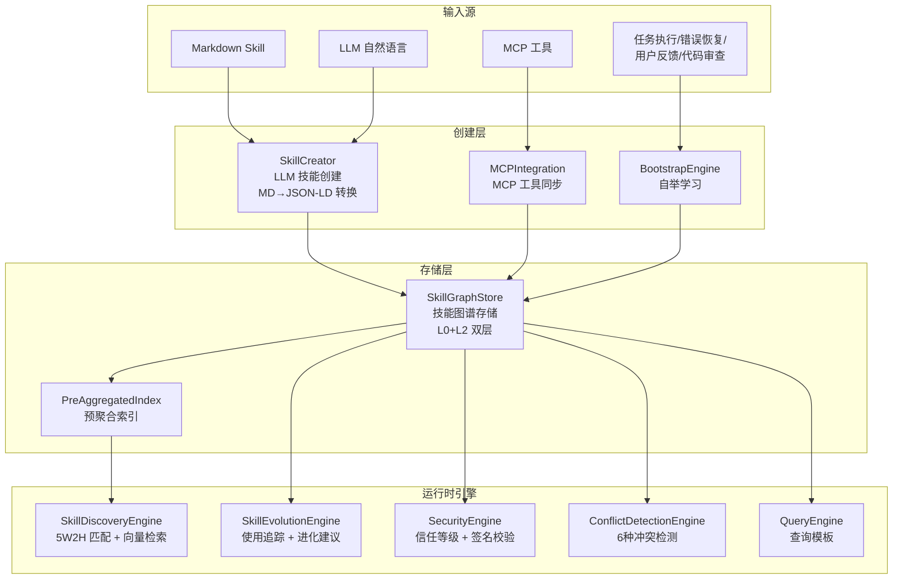
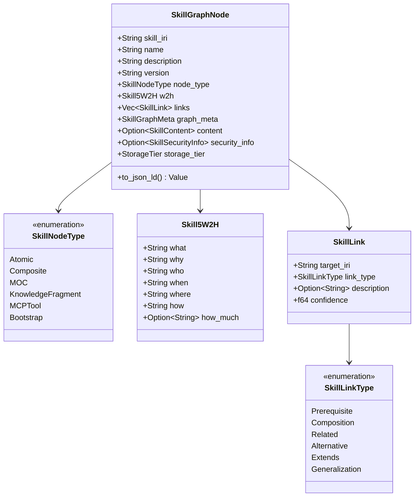
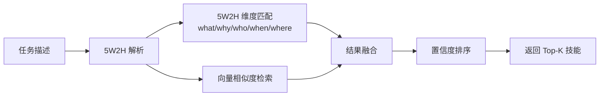
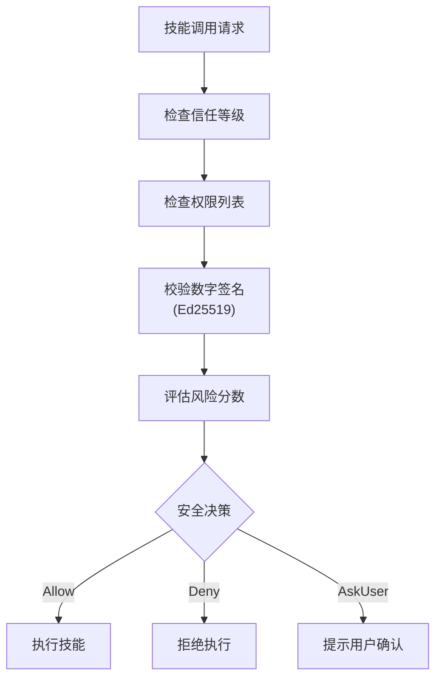
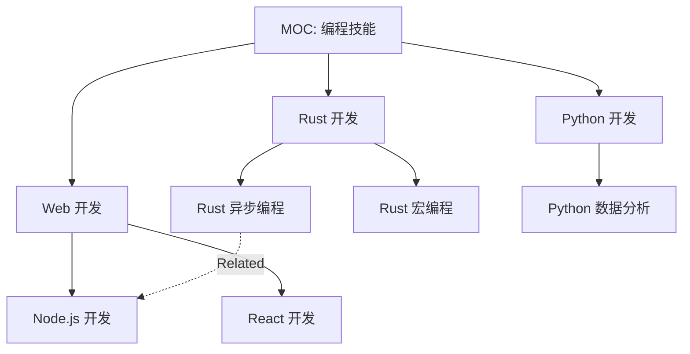
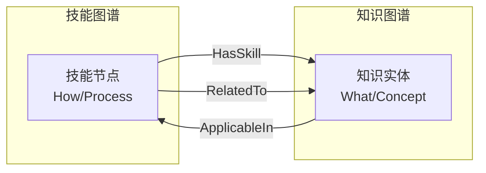

# 9. 技能图谱系统

> 基于 JSON-LD 的技能知识图谱，支持 5W2H 描述、技能发现、进化、冲突检测和自举学习

## 模块架构

**源文件目录**: `src/skill_graph/`（15 个模块）

## 模块文件清单

| 文件 | 组件 | 说明 |
|------|------|------|
| `types.rs` | SkillGraphNode, SkillNodeType, SkillLink, Skill5W2H | 核心类型定义 |
| `graph_store.rs` | SkillGraphStore | 技能图谱存储（L0 + L2） |
| `index.rs` | PreAggregatedIndex | 预聚合索引 |
| `discovery.rs` | SkillDiscoveryEngine | 5W2H 技能发现引擎 |
| `evolution.rs` | SkillEvolutionEngine | 技能进化引擎 |
| `conflict.rs` | ConflictDetectionEngine | 冲突检测引擎 |
| `security.rs` | SecurityEngine | 安全引擎 |
| `skill_creator.rs` | SkillCreator | LLM 技能创建 |
| `bootstrap.rs` | BootstrapEngine | 自举学习 |
| `mcp_integration.rs` | MCPIntegration | MCP 工具同步 |
| `query_templates.rs` | QueryEngine | 查询模板 |
| `embedding.rs` | SkillEmbeddingEngine | 庞加莱结构嵌入计算 |
| `graph_algorithms.rs` | GraphAlgorithmEngine | 图算法（PageRank/介数中心性/社区发现） |
| `verification.rs` | InvariantVerifier | 形式化不变式验证（6 种检查） |

## 核心类型

### SkillGraphNode — 技能节点

### 存储层级

| 层级 | 类型 | 说明 |
|------|------|------|
| `L0Permanent` | redb | 永久存储，核心技能 |
| `L1Session` | 内存 | 会话级临时技能 |
| `L2Blackboard` | Oxigraph | 共享黑板，跨 Agent 可见 |
| `L3Projection` | SPARQL | 按需投影 |

## 引擎详解

### SkillDiscoveryEngine — 技能发现

基于 5W2H 维度匹配和向量检索的技能发现：

**文件**: `src/skill_graph/discovery.rs`

### SkillEvolutionEngine — 技能进化

追踪技能使用情况，生成进化建议：

**文件**: `src/skill_graph/evolution.rs`

| 进化建议类型 | 说明 |
|-------------|------|
| `AddLink` | 添加新的技能关联 |
| `UpdateSuccessRate` | 更新成功率 |
| `CreateFragment` | 创建知识碎片 |
| `Deprecate` | 标记废弃 |
| `Merge` | 合并相似技能 |
| `Split` | 拆分过大的技能 |

### ConflictDetectionEngine — 冲突检测

**文件**: `src/skill_graph/conflict.rs`

6 种冲突类型：

| 冲突类型 | 说明 |
|---------|------|
| `Resource` | 资源竞争冲突 |
| `Dependency` | 依赖版本冲突 |
| `Permission` | 权限冲突 |
| `Semantic` | 语义定义冲突 |
| `Temporal` | 时序冲突 |
| `Version` | 版本冲突 |

### SecurityEngine — 安全引擎

**文件**: `src/skill_graph/security.rs`

### SkillCreator — LLM 技能创建

**文件**: `src/skill_graph/skill_creator.rs`

支持两种创建模式：

1. **自然语言创建**：用户描述需求 → LLM 生成 JSON-LD Skill 定义
2. **Markdown 转换**：读取 skill.md → LLM 转换为 JSON-LD 格式

### BootstrapEngine — 自举学习

**文件**: `src/skill_graph/bootstrap.rs`

从运行时经验中自动学习新技能：

| 学习来源 | 说明 |
|---------|------|
| 任务执行 | 成功执行的任务模式 |
| 错误恢复 | 修复错误的策略 |
| 用户反馈 | 用户显式指导 |
| 代码审查 | 代码改进建议 |
| 知识抽取 | 从文档中提取 |

**操作类型**：
- `Learn` — 创建新技能或增强现有技能
- `Reduce` — 简化过于复杂的技能

### MCPIntegration — MCP 工具同步

**文件**: `src/skill_graph/mcp_integration.rs`

将 MCP 工具自动同步为技能图谱中的技能节点。

## MOC 导航

MOC（Map of Content）节点作为技能图谱的导航入口：

## 新增高级特性

### 庞加莱结构嵌入 (SkillEmbeddingEngine)

**文件**: `src/skill_graph/embedding.rs`

从图谱拓扑结构自动计算技能节点的几何嵌入向量。嵌入依据：
- 先决条件深度（Prerequisite depth）
- 标签指纹（Tag fingerprinting）
- 链接拓扑模式

嵌入向量用于庞加莱球空间中的语义相似度搜索和结构聚类。

### 图算法引擎 (GraphAlgorithmEngine)

**文件**: `src/skill_graph/graph_algorithms.rs`

内置图算法引擎提供丰富的图谱分析能力：

| 算法 | 用途 |
|------|------|
| PageRank | 技能重要性排序，识别核心技能 |
| 介数中心性 (Betweenness) | 关键路径瓶颈检测 |
| 标签传播社区发现 | 自动技能聚类 |
| DFS 先决条件链 | 发现完整技能依赖链 |
| Tarjan SCC | 循环依赖检测 |

### 形式化不变式验证 (InvariantVerifier)

**文件**: `src/skill_graph/verification.rs`

对技能图谱执行 6 种不变式检查，确保图结构完整性：

| 检查 | 说明 |
|------|------|
| 无环性 | 无循环依赖 |
| 链接存在性 | 无悬空引用 |
| 组合可达性 | 所有子技能可访问 |
| 无废弃先决条件 | 无已废弃技能被引用 |
| 有效 5W2H | 所有技能 5W2H 元数据完整 |
| 有效安全等级 | 无越权链接 |

违反检查的操作在提交前被拒绝，并返回具体错误原因。

### 超图组合 (Hypergraph)

技能图谱支持第一类超图组合，通过 `Hyperedge` 类型和 `CompositionType` 枚举定义复杂工作流：

| 组合类型 | 语义 |
|---------|------|
| Sequential | 顺序执行 |
| Parallel | 并行执行 |
| Conditional | 条件分支 |
| Optional | 可选步骤 |
| Fallback | 回退策略 |

### 时间版本控制 (Temporal Versioning)

技能图谱支持快照和回滚机制：
- 每次图操作前自动创建快照
- 验证失败时自动回滚
- 手动创建基线快照用于发布版本

### Oxigraph SPARQL 桥接

实现 `SkillGraphStore` 与统一 Oxigraph RDF 存储之间的实时双向同步：
- 图写入时通过 SPARQL INSERT 同步到 `system:skills` 命名图
- 外部 SPARQL 更新时自动反同步回内存图
- 命名图隔离防止跨子系统数据污染

### 语义技能发现增强

`SkillDiscoveryEngine` 已集成 HyperspaceEngine 向量存储：
- `suggest_links()` 从 Jaccard 标签重叠降级为 HyperspaceStore 余弦相似度搜索
- `find_skill_chain()` BFS 路径搜索
- `get_skill_tree()` 组合树构建
- 混合文本×结构搜索（向量×图拓扑）

## 与知识图谱的关系

技能图谱和知识图谱是互补的双层架构：

| 维度 | 技能图谱 | 知识图谱 |
|------|---------|---------|
| 存储 | L0 redb + L2 Oxigraph | Oxigraph Memory（`Arc<Mutex>`） |
| 命名图 | `graph:skill` | `graph:world` / `graph:code` |
| 描述 | 5W2H 结构化 | RDF Quads |
| 发现 | 5W2H 匹配 + HyperspaceEngine 向量检索 + 图算法 | SPARQL + 模糊搜索 |
| 进化 | 使用追踪 + 进化建议 + 形式化验证 | 增量更新（SHA256） |
| 超图 | Hyperedge + CompositionType（顺序/并行/条件/可选/回退） | — |
| 不变式验证 | 6 种验证（无环/可达性/无废弃/安全/5W2H） | — |
| 版本控制 | 快照 + 回滚 | — |
