# 行为工程系统设计：根因引擎与方法论体系

> **文档编号**: 11  
> **版本**: v1.0  
> **范围**: RootCauseEngine 根因回溯模块 + MethodologyGate 方法论体系的完整详细设计  
> **定位**: 建立在宪法层 (L3) 之上，为 Agent 行为提供系统化工程保障

---

## 目录

1. [体系总览](#1-体系总览)
2. [四层行为工程架构](#2-四层行为工程架构)
3. [根因引擎 (RootCauseEngine)](#3-根因引擎-rootcauseengine)
4. [方法论体系 (Methodology System)](#4-方法论体系-methodology-system)
5. [宪法绑定与联动机制](#5-宪法绑定与联动机制)
6. [自进化反馈回路](#6-自进化反馈回路)
7. [与现存系统的集成](#7-与现存系统的集成)
8. [配置与扩展指南](#8-配置与扩展指南)

---

## 1. 体系总览

Gliding Horse 的行为工程系统分为 **四个层次**，从基础的行为准则到底层的代码级硬执行，形成一个完整的约束—引导—执行—进化闭环：

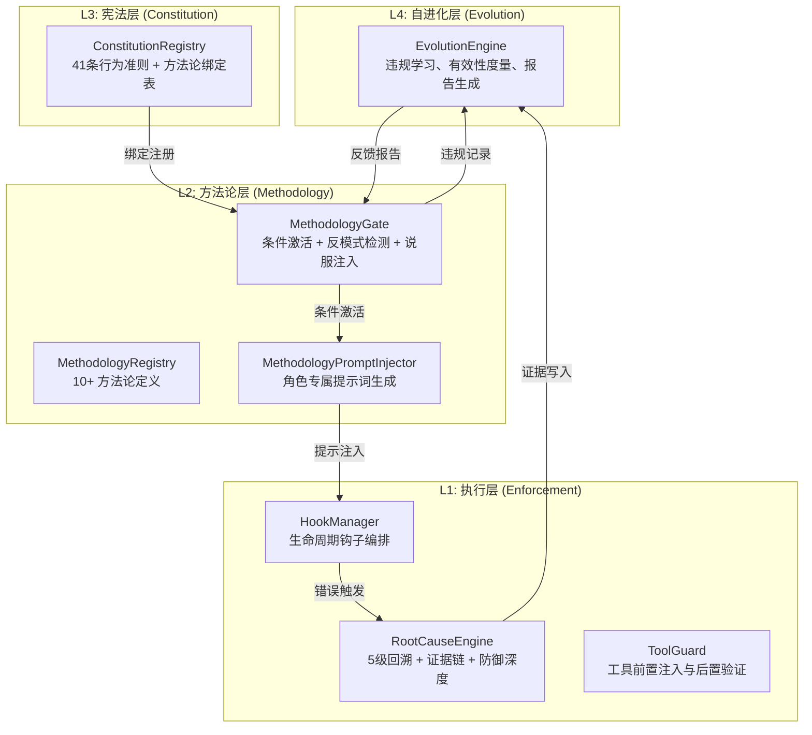

每一层的职责与约束力如下：

| 层级 | 名称 | 约束力 | 生命周期 | 核心产出 |
|------|------|--------|---------|---------|
| L4 | **自进化层** | 数据驱动，指导性 | 持续运行 | 违规模式报告、有效性评分 |
| L3 | **宪法层** | 永远存在，不可绕过 | 系统启动即加载 | 行为准则文本、方法论绑定表 |
| L2 | **方法论层** | 按需激活，条件触发 | 任务匹配时激活 | 反模式阻断、说服注入、提示词 |
| L1 | **执行层** | 代码级硬阻断 | 始终运行 | 回溯追踪、工具拦截、钩子调度 |

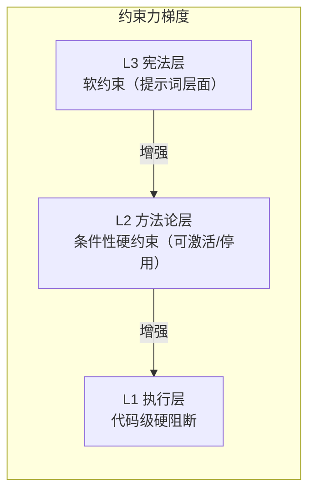

---

## 2. 四层行为工程架构

### 2.1 L3 — 宪法层 (Constitution)

宪法层是行为体系的**基础锚点**。它在系统启动时从 `ConstitutionRegistry` 加载，包含 41 条结构化行为准则，覆盖三个维度：

- **感知原则 (Perception)**: 全量阅读、索引优先、实时确认、歧义澄清
- **验证原则 (Verification)**: 自动验证、根因分析、回归验证
- **边界原则 (Boundary)**: 最小权限、风险预警、边界拒绝、任务范围坚守

每条准则可绑定到零个或多个方法论，形成 L3→L2 的映射表。当一条准则的触发条件满足时，关联的方法论自动激活。

### 2.2 L2 — 方法论层 (Methodology)

方法论层是行为体系的**条件可编程层**。每个方法论是一个结构化的行为协议，包含：

```
MethodologyDefinition
├── id / name / description     # 身份标识
├── methodology_type            # Discipline | Guidance | Reference | Process
├── domain                      # "general" | "programming" | 可扩展
├── red_flags[]                 # 红线项：需警惕的行为模式
│   ├── pattern                 # 匹配模式
│   ├── severity                # Critical / Warning / Info
│   └── rationalization_check   # 自欺欺人检查文本
├── anti_patterns[]             # 反模式：需阻断的行为模式
│   ├── gate_before             # 在什么操作前触发
│   ├── gate_ask                # Agent 应自问的问题
│   └── gate_action             # STOP / ABORT / WARN
├── persuasion                  # 说服框架
│   ├── principles              # authority / commitment / social_proof 等
│   └── phrasing_examples       # 具体措辞示例
├── activation                  # 激活条件
│   └── Always / OnToolCategory / OnHookPoint / OnPhaseEnd / OnTaskError / OnAgentRole
└── related[]                   # 关联方法论 ID
```

**四种方法论类型**：

| 类型 | 语义 | 提示前缀 | 示例 |
|------|------|---------|------|
| **Discipline** | 硬规则，权威语气 | 📜 [严格纪律] | TDD: "YOU MUST test before code" |
| **Guidance** | 引导，协作语气 | 💡 [指导建议] | 复杂度评估: "Be honest about difficulty" |
| **Reference** | 参考信息 | 📖 [参考资料] | 工具映射、技能描述 |
| **Process** | 多步骤流程 | 📋 [流程规范] | 头脑风暴: "Let's explore before building" |

### 2.3 L1 — 执行层 (Enforcement)

执行层采用 **HookManager** 统一编排，在 Agent 生命周期的关键点插入执行逻辑：

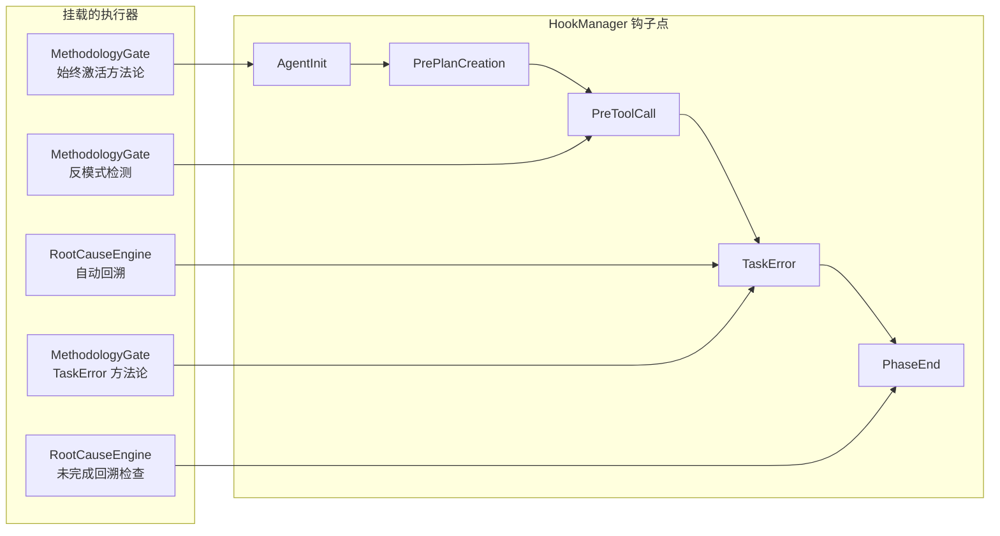

主要钩子点与执行器对应关系：

| 钩子点 | 触发时机 | 执行器 | 行为 |
|--------|---------|--------|------|
| `AgentInit` | Agent 初始化 | MethodologyGate | 激活 Always-on 方法论 |
| `PrePlanCreation` | 计划创建前 | MethodologyGate | 激活 brainstorming 等方法论 |
| `SkillBefore` | 工具调用前 | MethodologyGate | 反模式检测，阻断违规调用 |
| `TaskError` | 任务出错 | RootCauseEngine | 自动 5 级回溯追踪 |
| `TaskError` | 任务出错 | MethodologyGate | 激活 systematic-debugging 等方法论 |
| `PhaseEnd` | 阶段结束 | RootCauseEngine | 检查是否有未完成的根因分析 |
| `PhaseEnd` | 阶段结束 | MethodologyGate | 激活 verification-before-completion 等方法论 |

### 2.4 L4 — 自进化层 (Evolution)

自进化层收集 L1 和 L2 的执行数据，进行聚合分析，生成反馈报告指导系统改进。详见第 6 节。

---

## 3. 根因引擎 (RootCauseEngine)

### 3.1 设计目标

RootCauseEngine 的目标是提供结构化的错误分析能力：

1. **系统性**：不依赖直觉或经验，而是通过固定算法自动完成回溯
2. **可验证**：每一级回溯都有证据支撑，证据链可校验
3. **可行动**：分析结果直接转化为防御建议，指导代码改进
4. **可集成**：通过 HookManager 自动触发，无需人工干预

### 3.2 模块结构

```
src/root_cause/
├── mod.rs          # RootCauseEngine 主入口 + TracedResult + Hook 集成
├── config.rs       # 配置验证测试
├── types.rs        # 核心类型定义（TraceChain, TraceLevel, Evidence, 错误类型等）
├── tracer.rs       # BackwardTracer — 5 级回溯算法 + 错误模式匹配
├── evidence.rs     # EvidenceChainManager — 证据链验证 + 置信度计算
└── defense.rs      # DefenseInDepthManager — 防御深度建议 + 定向建议
```

### 3.3 核心算法：5 级回溯追踪

从故障点开始，逐级向上追溯，直到找到原始触发点。每一级都要回答："什么调用了这个？"和"传入的值是什么？"。

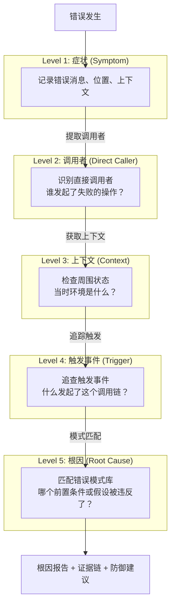

#### 算法伪代码

```
function trace_backward(error, context):
    // Level 1: 症状
    chain.add(symptom_level(error.message, error.location))
    
    // Level 2: 直接调用者
    caller_info = extract_caller(error.message, error.location)
    chain.add(caller_level(caller_info))
    
    // Level 3: 上下文
    chain.add(context_level(context.task_type, context.logs))
    
    // Level 4: 触发事件
    chain.add(trigger_level(context.task_type))
    
    // Level 5: 模式匹配 → 根因
    for pattern in pattern_db:
        if error.message matches pattern:
            chain.add(root_cause_level(pattern))
            break
    
    if chain.root_confidence < min_confidence:
        return FAIL("证据置信度不足")
    
    return chain
```

#### 具体实现（Rust 关键结构）

```rust
// 5 级回溯追踪器
pub struct BackwardTracer {
    config: RootCauseConfig,
    active_traces: RwLock<HashMap<String, TraceChain>>,
    pattern_db: Vec<ErrorPattern>,
}

// 错误模式（内置 7 种常见模式）
pub struct ErrorPattern {
    pub pattern: &'static str,              // "connection refused|connection reset|timeout"
    pub root_cause_label: &'static str,     // "network_error"
    pub root_cause_description: &'static str, // "网络连接失败..."
    pub confidence: f64,                    // 0.9
}
```

**内置错误模式库**：

| 模式 | 标签 | 置信度 | 描述 |
|------|------|--------|------|
| `connection refused\|connection reset\|timeout` | network_error | 0.9 | 网络连接失败 |
| `not found\|no such file\|enoent` | resource_not_found | 0.85 | 资源不存在 |
| `permission denied\|access denied\|eacces` | permission_error | 0.9 | 权限不足 |
| `syntax error\|parse error\|invalid syntax` | syntax_error | 0.8 | 语法错误 |
| `out of memory\|oom\|disk full` | resource_exhausted | 0.9 | 资源耗尽 |
| `null pointer\|undefined\|unwrap.*none` | null_reference | 0.85 | 空引用 |
| `invalid argument\|bad request\|400` | invalid_input | 0.8 | 无效输入 |

### 3.4 证据链验证 (EvidenceChainManager)

每一级的回溯结果形成一个证据节点，这些节点组成证据链。证据链必须满足：

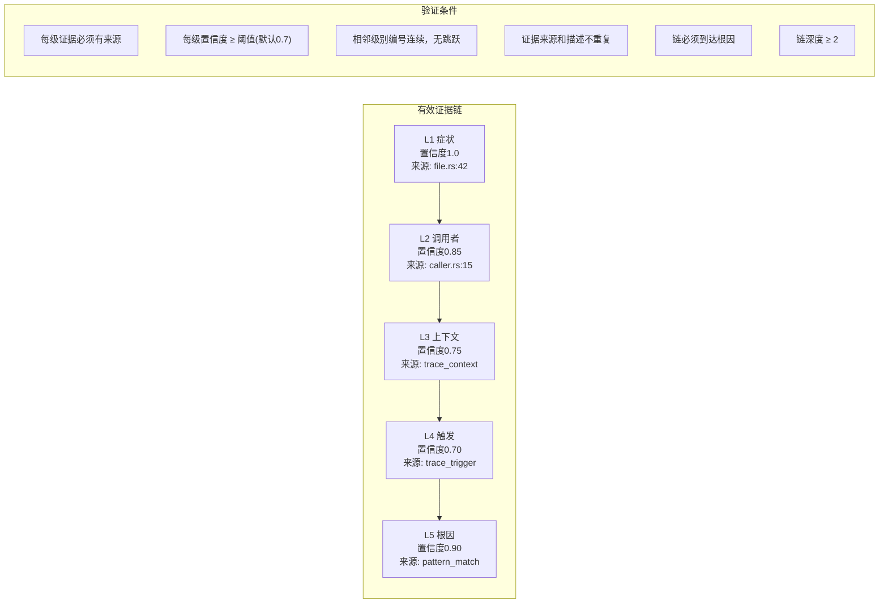

#### 置信度计算

整体置信度使用**几何平均**：

```
chain_confidence = ( ∏ confidence_i ) ^ (1 / n)
```

几何平均的优点：任何一个级别置信度过低都会显著拉低整体值，防止"单项高分掩盖薄弱环节"。

#### 证据报告生成

验证通过后，`evidence_report()` 生成人类可读的报告：

```
===== 证据链报告 [trace_abc123] =====
代理: agent_1 | 任务: GET /api/users failed

  L1 symptom
    描述: 错误发生: connection refused: failed to connect to 127.0.0.1:8080
    来源: src/http/client.rs:42
    置信度: 1.00

  L2 intermediate
    描述: 调用者: network_operation (调用位置: src/http/client.rs:42:0)
    来源: src/http/client.rs:42:0
    置信度: 0.85
  ...

综合置信度: 0.82
状态: 已定位根因
```

### 3.5 防御深度建议 (DefenseInDepthManager)

从根因分析结果生成 4 层防御建议：

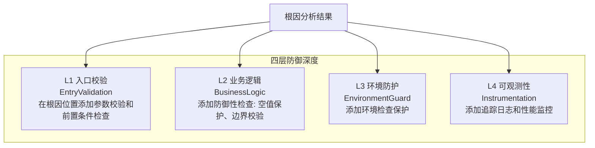

**定向建议**：如果错误匹配到已知模式，生成针对性的建议而非通用建议：

| 根因类型 | 建议 1 | 建议 2 |
|---------|--------|--------|
| network_error | 指数退避重试 | 连接前网络健康检查 |
| resource_not_found | 访问前验证路径存在 | 提供降级方案 |
| permission_error | 操作前检查权限 | 给出提权建议 |
| null_reference | 解引用前检查 null | 提供缺省值 |
| resource_exhausted | 操作前检查资源使用率 | 限流熔断 |
| invalid_input | 入口处参数完整校验 | 记录关键参数值 |
| syntax_error | 解析前验证格式 | 给出明确错误信息 |

### 3.6 Hook 集成

RootCauseEngine 通过 HookManager 注册两个同步钩子：

```
Hook 1: TaskError @ priority 90
  行为: 自动触发 5 级回溯
  输入: error.message, source_location, HookContext
  输出: TracedResult (保存于 engine.active_traces)
  异常: 回溯失败仅记录日志，不阻断执行

Hook 2: PhaseEnd(DO) @ priority 50
  行为: 检查是否有未完成的根因分析
  条件: 当前阶段为 DO，且 task_id 有未解决的回溯
  阻断: 检测到未完成回溯 → 设置 ctx.error → HookResult::Abort
  消息: "行为准则违反: 根因分析未完成就进行修复"
```

---

## 4. 方法论体系 (Methodology System)

### 4.1 体系组成

方法论体系由四个子系统组成，分别负责定义、触发、注入和进化：

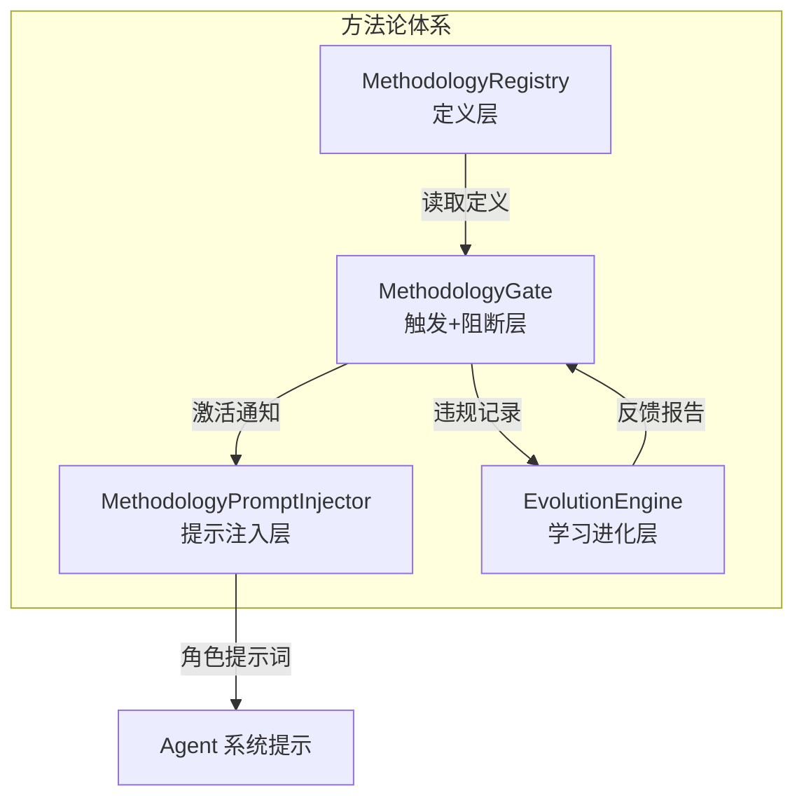

### 4.2 MethodologyRegistry — 定义层

方法论定义存储在 `MethodologyDefinition` 结构体中，通过 `builtin_methodologies()` 初始化。当前内置 10 个方法论：

| ID | 名称 | 类型 | 领域 | 激活条件 |
|----|------|------|------|---------|
| `index-priority` | 索引优先策略 | Discipline | general | OnToolCategory(file_search) |
| `cost-awareness` | 成本意识协议 | Discipline | general | OnHookPoint(PreToolCall) |
| `least-privilege` | 最小权限协议 | Discipline | general | OnToolCategory(shell, file_write, network) |
| `complexity-assessment` | 复杂度诚实评估 | Guidance | general | OnAgentRole(SA, PA) |
| `boundary-enforcement` | 边界强制执行 | Discipline | general | Always |
| `using-superpowers` | 技能使用方法论 | Discipline | general | Always |
| `brainstorming` | 头脑风暴方法论 | Process | general | OnHookPoint(PrePlanCreation) |
| `test-driven-development` | 测试驱动开发 | Discipline | programming | OnToolCategory(file_write, code_generation) |
| `systematic-debugging` | 系统化调试 | Process | programming | OnTaskError |
| `verification-before-completion` | 完成前验证 | Discipline | general | OnPhaseEnd(ACT) |

#### 设计原则

1. **通用方法论可跨领域**：`domain: "general"` 的方法论适用于任何领域
2. **编程方法论按需扩展**：`domain: "programming"` 通过 `Methodology Skill Graph` 扩展
3. **任务抽象为通用流程**：核心流程（头脑风暴→写计划→执行→审查→验证）适用于编程、写作、设计等任何任务类型
4. **专业领域通过方法论图谱扩展**：编程、数据分析、设计等领域通过 `Gliding Horse Skills` 体系独立扩展，不混淆在核心方法论中

### 4.3 MethodologyGate — 触发与阻断层

MethodologyGate 是方法论体系的核心执行器。它维护一个**当前激活方法论集合**，在每个钩子点评估是否需要激活新方法论，并在工具调用前执行反模式检测。

#### 激活流程

```mermaid
sequenceDiagram
    participant Hook as HookManager
    participant Gate as MethodologyGate
    participant Registry as MethodologyRegistry

    Hook->>Gate: on_hook_trigger(point, context)
    
    loop 每个方法论
        Gate->>Registry: 遍历所有方法论
        Registry-->>Gate: MethodologyDefinition
        
        alt 已激活
            Gate->>Gate: 跳过（防重复激活）
        else 条件匹配
            Gate->>Gate: 创建 ActivatedMethodology
            note right: 记录触发源、时间戳
            
            alt 未达上限
                Gate->>Gate: 加入 active 列表
                Gate-->>Hook: 返回新激活列表
            end
        end
    end
    
    loop 每个注册的宪法绑定
        Gate->>Gate: 评估宪法触发条件
        alt 匹配且未激活
            Gate->>Gate: 加入 active 列表
        end
    end
```

**激活条件评估逻辑**：

| 条件类型 | 评估方式 |
|---------|---------|
| `Always` | 无条件激活 |
| `OnToolCategory(categories)` | 比较工具名与分类映射表 |
| `OnHookPoint(hook)` | 钩子点名称精确匹配 |
| `OnPhaseEnd(phase)` | PhaseEnd 钩子 + phase 数据匹配 |
| `OnTaskError` | TaskError 钩子 + error 存在 |
| `OnAgentRole(roles)` | Agent 角色名匹配（大小写不敏感） |

#### 反模式检测

在 `SkillBefore` 钩子点，Gate 对当前工具名执行反模式检查：

```
对于活跃方法论的每个反模式:
    1. 检查 gate_before 是否匹配当前工具名
    2. 如果匹配:
       a. 如果 gate_action 是 STOP 或 ABORT:
          → 设置 ctx.error = 反模式描述
          → 返回 HookResult::Abort (阻断工具调用)
       b. 否则 (WARN):
          → 记录到 ctx.metadata
          → 继续执行
```

**检测到阻断时的信息格式**：

```
⚠️ 反模式 [方法论名称]: 反模式名 — 详细描述
自问: [gate_ask 问题]
行动: [STOP / ABORT / WARN]
```

#### 说服注入

活跃方法论的说服文本会被收集并格式化为提示词注入：

```
📜 [严格纪律] Always verify before claiming done (完成前验证)
💡 [指导建议] Be honest about difficulty (复杂度诚实评估)
📋 [流程规范] Let's explore before building (头脑风暴方法论)
```

说服文本通过 `persuasive_directives()` 收集，最终由 `MethodologyPromptInjector` 注入到 Agent 的系统提示词中。

### 4.4 MethodologyPromptInjector — 提示注入层

为每个 Agent 角色生成方法论专属的提示词片段，与宪法层行为准则一起注入。

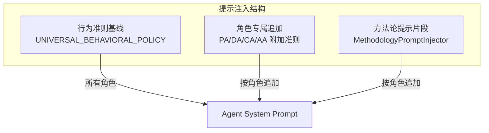

#### 各角色方法论注入

| 角色 | 方法论级别 | 注入内容 |
|------|-----------|---------|
| **PA (Plan)** | 详细 | 步骤粒度检查 + 复杂度匹配 + 边界检查 |
| **DA (Do)** | 无 | 仅使用宪法基线，不追加方法论 |
| **CA (Check)** | 详细 | 双阶段审计（输出验证 + 方法论合规）+ 反模式检测 + 证据要求 |
| **AA (Act)** | 详细 | 压力测试协议 + 元测试协议 + 决策责任 |
| **SA (Supervisor)** | 完整 | 始终激活方法论列表 + 角色触发列表 + 计划生成要求 |

**PA 方法论段落实例**：

```
## 📋 方法论纪律 — 计划审查闸门
作为计划Agent，你必须遵守以下方法论纪律：

### 1. 步骤粒度检查
对每个计划步骤，必须评估其粒度是否合适：
- ✅ 过粗：一个步骤包含多个不相关的操作 → 拆解
- ✅ 过细：一个步骤只包含原子操作 → 合并
- ✅ 标准：一个步骤包含一组相关的操作，有明确的输入和产出

### 2. 复杂度匹配
所选复杂度级别必须与任务实际需求匹配，禁止：
- 省事降级：为省事选择低于实际需求的级别
- 炫耀升级：为炫技选择高于实际需求的级别

### 3. 边界检查
计划中不得包含越界操作：
- 检查每个步骤的职责是否在 Agent 权限范围内
- 如果发现越界，必须标记并建议修正
```

---

## 5. 宪法绑定与联动机制

宪法层 (L3) 与方法论层 (L2) 通过**绑定表**联动。每条宪法准则可以绑定到零个或多个方法论，并指定触发条件。

### 5.1 绑定结构

```rust
pub struct ConstitutionMethodologyBinding {
    pub constitution_id: String,    // 例如 "uni-verification-2"
    pub methodology_id: String,     // 例如 "methodology:systematic-debugging"
    pub condition: TriggerCondition,  // 触发条件
}
```

### 5.2 关键绑定示例

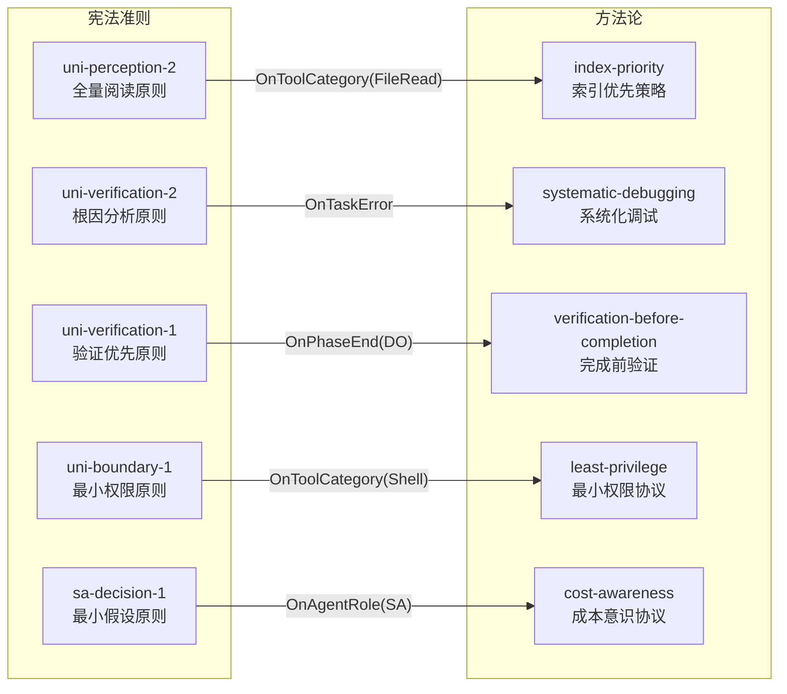

### 5.3 联动流程

当一条宪法准则的触发条件满足时：

1. `MethodologyGate.on_hook_trigger()` 被调用
2. 遍历所有注册的宪法绑定，评估触发条件
3. 匹配的绑定 → 激活对应方法论
4. 活跃方法论产生说服文本 → 由 `MethodologyPromptInjector` 注入提示词
5. PolicyAgent 生成包含方法论纪律的 Agent 计划

---

## 6. 自进化反馈回路

### 6.1 数据流

EvolutionEngine 收集来自 MethodologyGate 和 RootCauseEngine 的违规数据，进行聚合分析：

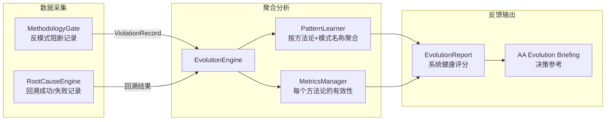

### 6.2 核心数据结构

```rust
// 违规记录
pub struct ViolationRecord {
    pub methodology_id: String,   // 哪个方法论被违反
    pub pattern_type: PatternType, // RedFlag | AntiPattern
    pub pattern_name: String,     // 模式名称
    pub severity: RedFlagSeverity, // Critical | Warning | Info
    pub agent_role: String,       // 哪个角色触发
    pub blocked: bool,            // 是否阻断
    pub timestamp: u64,           // 发生时间
    pub task_id: Option<String>,  // 关联任务
}

// 学习到的模式
pub struct LearnedPattern {
    pub pattern_description: String,
    pub methodology_id: String,
    pub frequency: u64,            // 观察次数
    pub first_seen: u64,
    pub last_seen: u64,
    pub severity: RedFlagSeverity,
    pub frequent_roles: Vec<String>, // 最常见角色
}

// 方法论有效性指标
pub struct MethodologyMetrics {
    pub methodology_id: String,
    pub activation_count: u64,
    pub total_violations: u64,
    pub pass_count: u64,           // 无违规通过次数
    pub effectiveness_score: f64,  // 0.0~1.0
}
```

### 6.3 有效性计算

```
effectiveness = (passes + 1) / (activations + violations + passes + 1)

Critical 违规 → effectiveness *= 0.8
Warning 违规 → effectiveness *= 0.9
Info 违规    → effectiveness *= 0.95
```

**健康评分** = 所有方法论 effectiveness_score 的算术平均。

### 6.4 环形缓冲区

EvolutionEngine 默认保留最多 10,000 条违规记录。超出时删除最早的记录：

```
[record_0] → [record_1] → ... → [record_9999]
     ↑                              ↑
   删除                           新记录写入
```

### 6.5 AA 进化简报

EvolutionEngine 可生成 AA 消费的进化简报，摘要报告系统健康状态：

```
## 📊 方法论进化报告
系统健康评分: 85.3%
记录违规总数: 47
活跃方法论数: 8

### 高频违规模式
1. 🔴 methodology:index-priority — 全量遍历 (频率: 12, 角色: DA, PA)
2. 🟡 methodology:cost-awareness — 无比较方案 (频率: 8, 角色: PA)
3. 🔵 methodology:verification-before-completion — 无证据声明 (频率: 5, 角色: DA)

### 方法论有效性
✅ methodology:using-superpowers — 有效度: 95.0% (激活50次 / 违规1次 / 通过120次)
⚠️ methodology:index-priority — 有效度: 62.0% (激活30次 / 违规12次 / 通过45次)
🔴 methodology:cost-awareness — 有效度: 45.0% (激活20次 / 违规8次 / 通过10次)
```

### 6.6 完整反馈闭环

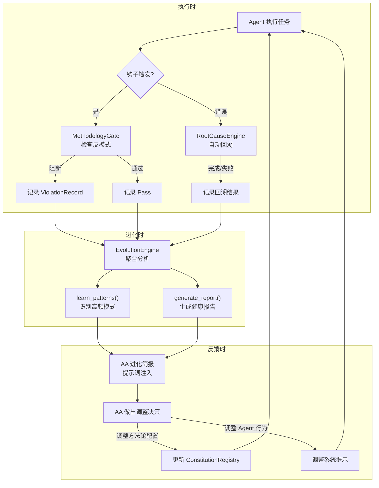

---

## 7. 与现存系统的集成

### 7.1 ToolGuard 集成

ToolGuard 在工具调用前后执行注入和验证。行为工程系统通过以下方式增强 ToolGuard：

| 组件 | 增强方式 | 集成点 |
|------|---------|--------|
| MethodologyGate | 反模式检测（SkillBefore 钩子） | `check_anti_patterns_for_tool()` |
| MethodologyPromptInjector | 说服文本注入 | 提示词格式化和角色映射 |
| ConstitutionRegistry | 行为准则前置注入 | `build_constitution_prompt()` |

### 7.2 EventBus 集成

行为工程系统通过 EventBus 发布事件：

| 事件 | 发布者 | 消费者 |
|------|--------|--------|
| `root_cause_trace_complete` | RootCauseEngine | 监控系统、日志 |
| `methodology_activated` | MethodologyGate | EvolutionEngine |
| `methodology_violation` | MethodologyGate | EvolutionEngine |
| `defense_recommendation` | RootCauseEngine | 知识图谱存储 |

### 7.3 知识图谱集成

行为工程系统的数据可通过 JSON-LD 序列化后存入 Oxigraph 知识图谱：

```rust
// MethodologyDefinition → JSON-LD 节点
impl MethodologyDefinition {
    pub fn to_json_ld(&self) -> serde_json::Value {
        // 生成包含 @context, @id, @type 的标准 JSON-LD
        // 包含: redFlags, antiPatterns, persuasion, related
    }
}
```

这使得方法论定义可以通过 SPARQL 查询，实现：
- 跨方法论关联分析
- 方法论使用模式的图查询
- 宪法→方法论绑定的关系挖掘

### 7.4 MCP 集成

MethodologyGate 可通过 MCP (Model Context Protocol) 暴露外部工具接口：

```rust
// 伪代码: 通过 MCP 暴露方法论查询
"tools": [
    {
        "name": "get_active_methodologies",
        "description": "查询当前活跃的方法论及反模式"
    },
    {
        "name": "report_methodology_violation",
        "description": "报告方法论违规，触发自进化学习"
    },
    {
        "name": "query_root_cause_trace",
        "description": "查询指定 trace_id 的根因分析结果"
    }
]
```

---

## 8. 配置与扩展指南

### 8.1 RootCauseEngine 配置

```rust
pub struct RootCauseConfig {
    /// 最大回溯深度 (默认 5)
    pub max_trace_depth: u8,
    /// 最低置信度阈值 (默认 0.7)
    pub min_confidence: f64,
    /// 是否启用自动回溯 (默认 true)
    pub enable_auto_trace: bool,
    /// 是否启用防御建议 (默认 true)
    pub enable_defense_recommendations: bool,
    /// 回溯超时毫秒 (默认 30000)
    pub trace_timeout_ms: u64,
}
```

### 8.2 扩展方法论

添加一个新方法论需要：

1. 在 `src/methodology/mod.rs` 的 `builtin_methodologies()` 中添加 `MethodologyDefinition`

```rust
MethodologyDefinition {
    id: "methodology:my-new-method",
    name: "我的新方法论",
    description: "描述这个方法论的目的和行为协议",
    methodology_type: MethodologyType::Discipline,  // Guidance | Process | Reference
    domain: "general",                                // 或 "programming"
    source: "团队约定 / 实践总结 / 文档来源",
    red_flags: &[
        RedFlagEntry {
            pattern: "要警惕的行为描述",
            severity: RedFlagSeverity::Warning,       // Critical | Info
            rationalization_check: Some("自欺欺人时的心理活动"),
        },
    ],
    anti_patterns: &[
        AntiPatternEntry {
            name: "反模式名称",
            description: "详细描述",
            gate_before: "在什么操作前触发检查",
            gate_ask: "Agent 应自问的问题",
            gate_action: "STOP — 阻断并说明原因",      // STOP | ABORT | WARN
        },
    ],
    persuasion: PersuasionProfile {
        principles: &["authority"],                    // authority | commitment | social_proof | etc.
        phrasing_examples: &["YOU MUST follow this rule"],
    },
    activation: ActivationCondition::OnHookPoint("PreToolCall"),  // 选择激活条件
    related: &["methodology:existing-method"],          // 关联方法论
}
```

2. （可选）在 `MethodologyPromptInjector` 中引用该方法论，生成角色专属提示

### 8.3 扩展错误模式

在 `BackwardTracer::default_patterns()` 中添加新的 `ErrorPattern`：

```rust
ErrorPattern {
    pattern: "custom error pattern|another pattern",
    root_cause_label: "my_custom_error",
    root_cause_description: "描述此错误的根因含义和修复方向",
    confidence: 0.85,
}
```

### 8.4 激活条件参考

| 条件 | 适用场景 | 示例 |
|------|---------|------|
| `Always` | 始终需要的方法论 | boundary-enforcement, using-superpowers |
| `OnToolCategory(["shell"])` | 与特定工具有关的方法论 | least-privilege |
| `OnHookPoint("PrePlanCreation")` | 在计划创建前触发 | brainstorming |
| `OnPhaseEnd("ACT")` | 在特定阶段结束时触发 | verification-before-completion |
| `OnTaskError` | 出错时触发 | systematic-debugging |
| `OnAgentRole(&[Supervisor])` | 特定角色激活 | complexity-assessment |

### 8.5 配置建议

不同场景的推荐配置：

| 场景 | max_trace_depth | min_confidence | enable_defense | max_active |
|------|----------------|---------------|----------------|-----------|
| 通用开发 | 5 | 0.7 | true | 20 |
| 生产环境 | 5 | 0.8 | true | 15 |
| 低频调试 | 7 | 0.6 | true | 25 |
| 性能优先 | 3 | 0.5 | false | 10 |
| 教学环境 | 5 | 0.3 | true | 30 |

---

> **设计原则总结**：行为工程系统采用层次化设计，宪法层提供不可绕过的行为锚定，方法论层提供条件可编程的行为协议，执行层提供代码级硬阻断，自进化层提供数据驱动的持续改进。四层协同，形成从约束到反馈的完整闭环，不限于任何特定领域。
