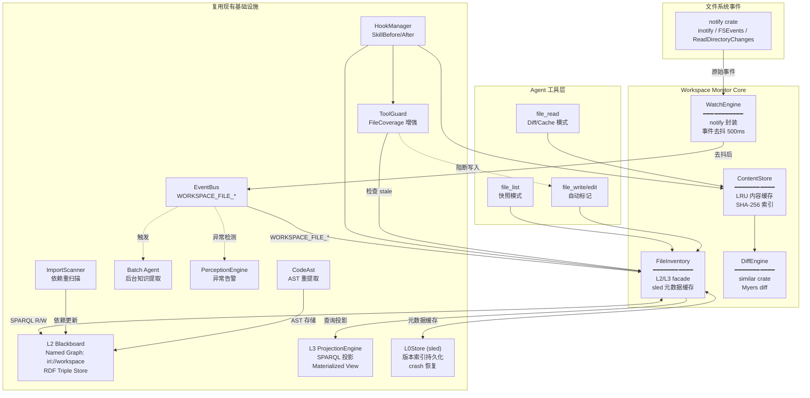
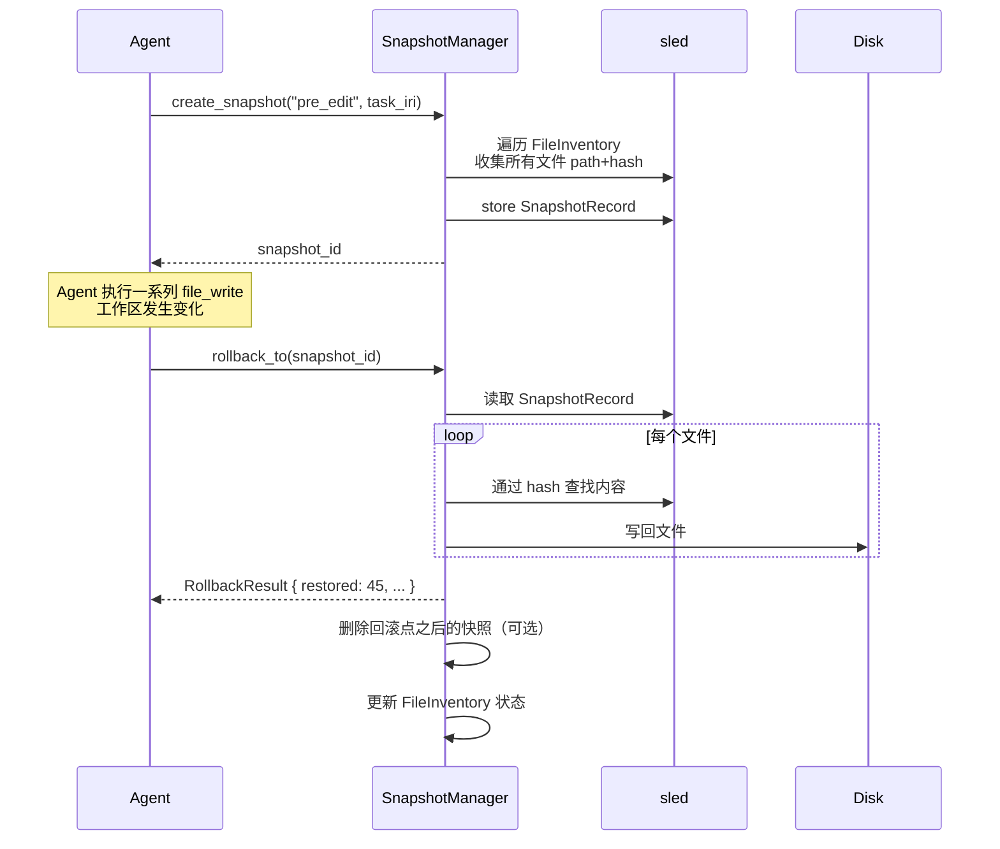
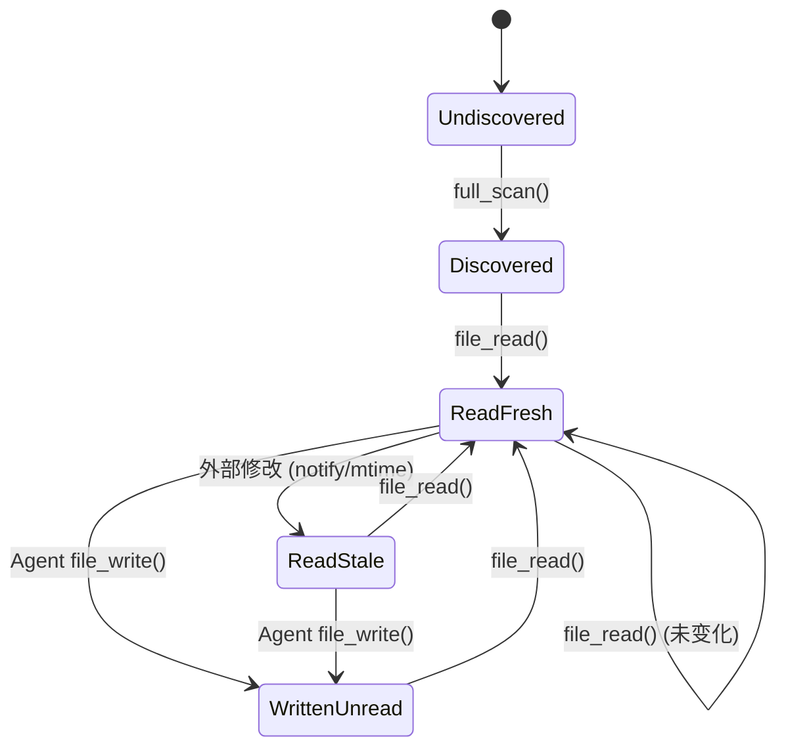
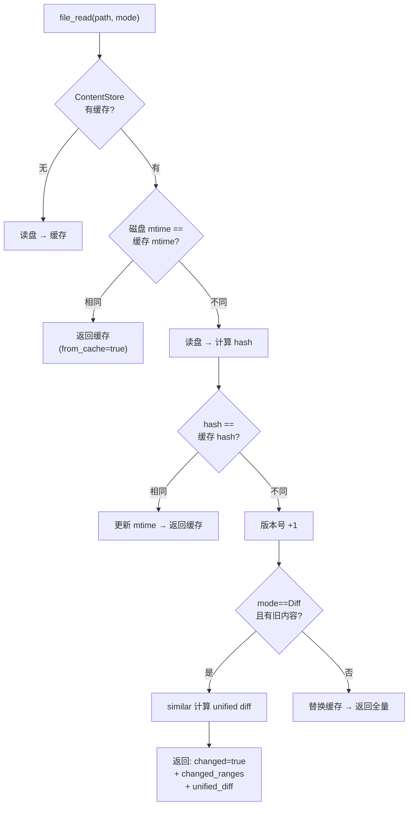

# 12. 工作区文件系统监控与内容管理（Workspace FileSystem Monitor）

## 12.1 问题背景

### 现状痛点

当前 glidingcode 在文件系统操作上存在以下问题：

1. **重复读取**：Agent 反复 `file_read` 同一个文件，不知道哪些已读过
2. **盲目 ls**：Agent 反复 `file_list` 探索目录结构，没有工作区快照
3. **变更无知**：Agent 不知道文件在两次读取之间是否被修改（上次读取 vs 当前状态）
4. **全量重读**：即使文件只改了几行，也必须全量重读，没有差分能力
5. **盲区文件**：Agent 不知道工作区存在哪些尚未发现/未读取的文件
6. **无状态上下文**：LLM 上下文窗口内关于文件状态的信息完全依赖自身记忆

### 现有可复用基础设施

| 系统 | 文件 | 可复用能力 |
|------|------|-----------|
| **sled** | 已依赖 `sled = "0.34"` | 高性能 KV 存储，微秒级读写，用于文件元数据持久化和版本索引 |
| **walkdir** | 已依赖 `walkdir = "2.4"` | 高效递归目录遍历 |
| **sha2** | 已依赖 `sha2 = "0.10"` | SHA-256 内容哈希 |
| **Oxigraph / L2** | `src/memory/l2_blackboard.rs` | RDF Triple Store + SPARQL 1.1 + Named Graph 隔离 |
| **L3 Projection** | `src/memory/l3_projection.rs` | SPARQL 投影 + Materialized View + Token 预算控制 |
| **EventBus** | `src/core/event_bus.rs` | O(1) bitmap 路由 + broadcast channel + spawn_consumer |
| **HookManager** | `src/tools/hooks.rs` | 18 个 HookPoint，SkillBefore/After 工具拦截 |
| **ToolGuard** | `src/tools/tool_guard.rs` | FileCoverage 行范围追踪 + Pre/Post validation hooks |
| **ImportScanner** | `src/tools/import_scanner.rs` | 6 语言 import 解析（Rust/TS/JS/Py/Go/Java/C） |
| **CodeAst** | `src/knowledge_graph/code_ast.rs` | tree-sitter AST + 内容哈希缓存 + `file:` IRI 映射 |
| **PerceptionEngine** | `src/perception/proactive_engine.rs` | 10 触发器 + 异常去重 + EventBus 消费 |
| **Batch Agent** | `src/batch/manager.rs` | 后台知识提取 + 实体/关系检测 + 自进化 |
| **L0Store** | `src/memory/l0_store.rs` | 持久化存储 + MESI 状态 + prefix scan |
| **MCP Client** | `src/tools/mcp_client.rs` | 外部工具发现（可透传文件状态到 MCP 工具） |

**现有依赖中已包含**: `sled`, `walkdir`, `sha2`。  
**需要新增**: `notify`, `notify-debouncer-mini`, `similar`, `lru`。  
**不需要 gix**：见下文 12.3.4 分析。

---

## 12.2 带来的提升（对现有系统的增强）

### 12.2.1 感知能力的质变

当前系统依赖 Agent **主动查询**（`glob_search`、`grep_search`、`file_list`）。文件监控系统可以**被动推送**：

| 维度 | 当前（主动轮询） | 新系统（被动推送） |
|------|-----------------|-------------------|
| 实时性 | Agent 需要反复 file_list 巡检 | notify 事件驱动，毫秒级感知 |
| 完整性 | 只知已列出的文件，存在盲区 | `full_scan()` 建立完整清单，所有文件有状态 |
| 上下文刷新 | Agent 需自行判断是否重读 | 变更事件 → L2 标记 stale → L3 投影自动反映最新状态 |
| 盲区消除 | 文件存在于磁盘但 Agent 不知道 | FileInventory 记录所有文件，`discovered_unread` 状态 |

### 12.2.2 上下文管理的精准度提升

| 能力 | 机制 |
|------|------|
| **已读/未读状态** | L2 Node 的 `ws:state` 属性：`read_fresh` / `read_stale` / `discovered_unread` / `written_unread` |
| **过期检测** | `ws:lastReadVersion < ws:currentVersion` → 提示 Agent "文件 X 已更新，是否重新读取" |
| **差分读取** | ContentStore 缓存旧版本 + DiffEngine 生成 unified diff → 只返回变更行 |
| **版本绑定** | 每次读取记录版本号，上下文引用可追溯到特定版本 |

### 12.2.3 工具执行的效率与安全性

| 增强 | 实现 |
|------|------|
| **ToolGuard 硬阻断** | Agent 试图 `file_edit` 一个 `read_stale` 文件 → HookManager SkillBefore 返回 Abort |
| **ImportScanner 自动刷新** | 文件变更 → 自动 re-scan imports → 更新 L2 中的 `ws:dependsOn` 关系 |
| **依赖图感知** | L2 中文件间的 `ws:importedBy` / `ws:dependsOn` 关系 → 变更一个文件时提示相关文件也需要检查 |
| **file_read 智能模式** | `ReadMode::Diff` — 文件变化时返回增量；`ReadMode::Full` — 首次读取或缓存失效 |

### 12.2.4 后台整理与自进化

| 增强 | 实现 |
|------|------|
| **Batch Agent 触发** | `WORKSPACE_FILE_MODIFIED` 事件 → 触发知识抽取 / 记忆压缩 |
| **经验学习** | 高频读取/修改文件统计 → 反馈到 Prompt 模板 / Skill Graph |
| **自动 AST 重提取** | 文件变更 → CodeAst 重解析 → 更新 Knowledge Graph 中的代码实体 |

---

## 12.3 总体架构



---

## 12.4 核心设计

### 12.4.1 存储架构 — 双层模型

**设计原则**：文件**元数据**走 L2 + sled，文件**内容**走 ContentStore。不混用。

```
查询路径:
  Agent file_list → FileInventory → sled (热缓存) → L2 SPARQL
  Agent file_read  → ContentStore → LRU 内存缓存 → 磁盘
  L3 投影查询     → L2 SPARQL → MaterializedView

写入路径:
  notify 事件     → EventBus → FileInventory → sled + L2 SPARQL UPDATE
  Agent file_write → HookManager → ContentStore.invalidate() + FileInventory.mark_written()
```

#### 为什么不用 gix？—— 含回滚能力分析

| 对比维度 | gix | sled + SnapshotManager | 评估 |
|----------|-----|----------------------|------|
| 编译时间 | ~60s | 0s（已编译） | sled 胜 |
| 二进制大小 | +~2MB | 0（已包含） | sled 胜 |
| 单文件版本存储 | blob + tree | sled key: `version:{hash}` → content | 相当 |
| **Workspace 快照** | commit（所有文件一致性快照） | `SnapshotRecord { path→hash map }` 存入 sled | 相当 |
| **Workspace 回滚** | checkout commit | 遍历 snapshot → 写回每个文件 | 相当 |
| Diff | git diff | similar crate（更轻量） | sled 更轻 |
| 分支/合并 | ✅ | ❌ 不需要 | Agent 不需要 |
| 增量提交 | ✅（自动） | ✅（仅变更文件更新 snapshot） | 相当 |

**回滚实现**（sled 方案）：

```rust
/// 工作区快照管理器
pub struct SnapshotManager {
    db: Arc<sled::Db>,
}

#[derive(Debug, Clone, Serialize, Deserialize)]
pub struct WorkspaceSnapshot {
    pub snapshot_id: String,
    pub created_at: i64,
    pub reason: String,         // "task_start", "pre_edit", "manual"
    pub task_iri: Option<String>,
    /// 文件路径 → 内容 hash
    pub files: Vec<SnapshotFileEntry>,
}

pub struct SnapshotFileEntry {
    pub path: String,
    pub hash: String,
    pub size: u64,
}

impl SnapshotManager {
    /// 创建当前工作区的完整快照
    pub fn create_snapshot(&self, reason: &str, task_iri: Option<&str>) -> Result<String>;

    /// 回滚整个工作区到指定快照
    /// 1. 遍历 snapshot.files
    /// 2. 对每个文件，从 sled 中通过 hash 查找内容
    /// 3. 写回磁盘
    pub fn rollback_to(&self, snapshot_id: &str) -> Result<RollbackResult>;

    /// 回滚单个文件到指定版本
    pub fn restore_file(&self, path: &str, hash: &str) -> Result<()>;

    /// 列出可用快照
    pub fn list_snapshots(&self, limit: usize) -> Vec<WorkspaceSnapshot>;
}

pub struct RollbackResult {
    pub snapshot_id: String,
    pub files_restored: usize,
    pub files_created: usize,
    pub files_deleted: usize,      // 在 snapshot 之后新增的文件
    pub failed: Vec<String>,
}
```

**回滚流程**：



**结论**：sled + SnapshotManager 可以支持 workspace 级别的快照和回滚，不需要 git 的 DAG 模型。Agent 场景不需要分支/合并/标签/远程同步，简单的时间线快照已足够。关键实现 ~150 行代码。

### 12.4.2 FileInventory — L2/L3 门面

**设计原则**：FileInventory 是薄门面，数据主存储在 L2（RDF Triple Store），热缓存用 sled。

#### RDF 数据模型（L2 Named Graph: `iri://workspace`）

```jsonld
{
  "@context": {
    "ws": "https://agent-harness.os/workspace#",
    "rdf": "http://www.w3.org/1999/02/22-rdf-syntax-ns#"
  },
  "@id": "iri://workspace/file/src/main.rs",
  "@type": ["ws:File"],
  "ws:filePath": "src/main.rs",
  "ws:fileSize": 12345,
  "ws:fileExt": "rs",
  "ws:language": "rust",
  "ws:mtime": 1718540000000,
  "ws:contentHash": "sha256:abc123...",
  "ws:state": "read_fresh",
  "ws:lastReadAt": 1718540010000,
  "ws:lastReadVersion": 3,
  "ws:currentVersion": 3,
  "ws:readCount": 5,
  "ws:parentDir": "iri://workspace/dir/src/",
  "ws:imports": ["iri://workspace/file/src/lib.rs"],
  "ws:importedBy": ["iri://workspace/file/src/app.rs"]
}
```

#### FileState 状态机



#### SPARQL 操作示例

```sparql
-- 列出目录下所有文件及状态
PREFIX ws: <https://agent-harness.os/workspace#>
SELECT ?path ?size ?state ?lastRead ?lang
WHERE {
  GRAPH <iri://workspace> {
    ?file a ws:File ;
          ws:filePath ?path ;
          ws:state ?state .
    OPTIONAL { ?file ws:fileSize ?size }
    OPTIONAL { ?file ws:lastReadAt ?lastRead }
    OPTIONAL { ?file ws:language ?lang }
    FILTER(STRSTARTS(?path, "src/"))
  }
} ORDER BY ?path

-- 查询文件的依赖关系
PREFIX ws: <https://agent-harness.os/workspace#>
SELECT ?importedBy ?importedByState
WHERE {
  GRAPH <iri://workspace> {
    <iri://workspace/file/src/lib.rs> ws:importedBy ?importedBy .
    ?importedBy ws:state ?importedByState .
  }
}

-- 统计文件状态分布
PREFIX ws: <https://agent-harness.os/workspace#>
SELECT ?state (COUNT(?file) as ?count) (SUM(?size) as ?totalBytes)
WHERE {
  GRAPH <iri://workspace> {
    ?file a ws:File ; ws:state ?state ; ws:fileSize ?size .
  }
} GROUP BY ?state
```

#### L3 预定义投影帧

```rust
// 在 ProjectionEngine 中新增的帧
fn load_workspace_frames() -> Vec<ProjectionFrame> {
    vec![
        // 帧 1: 目录列表
        ProjectionFrame {
            name: "workspace_dir_list".into(),
            target_role: "Do,Plan".into(),
            sparql_template: Some(/* SPARQL 如上 */),
            max_nodes: 200,
            max_size: 4096,
            ..
        },
        // 帧 2: 状态总览
        ProjectionFrame {
            name: "workspace_state_summary".into(),
            target_role: "All".into(),
            sparql_template: Some(/* 聚合查询 */),
            max_nodes: 10,
            max_size: 2048,
            ..
        },
        // 帧 3: 过期文件列表
        ProjectionFrame {
            name: "workspace_stale_files".into(),
            target_role: "Do".into(),
            sparql_template: Some(/* FILTER state IN (read_stale, ...)  */),
            max_nodes: 20,
            max_size: 4096,
            ..
        },
        // 帧 4: 依赖图（受影响的文件）
        ProjectionFrame {
            name: "workspace_affected_files".into(),
            target_role: "Do,Check".into(),
            sparql_template: Some(/* 变更文件的 importedBy 闭包 */),
            max_nodes: 50,
            max_size: 8192,
            ..
        },
    ]
}
```

### 12.4.3 ContentStore — 内容缓存与差分

**设计原则**：独立于 L2（内容太大不适合 RDF），使用 LRU 内存缓存 + 磁盘 sled 持久化。

```rust
pub struct ContentStore {
    /// 内存 LRU 缓存（文件路径 → 行数组）
    lines_cache: LruCache<String, CachedContent>,
    /// 文件路径 → 当前版本号
    version_index: HashMap<String, u64>,
    /// sled 持久化存储（用于历史版本内容）
    version_store: Option<sled::Db>,
    /// 缓存大小限制
    max_cache_bytes: usize,
    current_cache_bytes: usize,
}

struct CachedContent {
    lines: Vec<String>,
    hash: String,
    mtime: i64,
    version: u64,
}

pub enum ReadMode {
    /// 全量读取（首次或强制刷新）
    Full,
    /// 差分模式：文件变化时返回 unified diff
    Diff,
    /// 强制重读（忽略所有缓存）
    ForceRefresh,
}

pub struct ReadResult {
    pub path: String,
    pub lines: Vec<String>,
    pub total_lines: usize,
    pub changed: bool,
    pub changed_ranges: Option<Vec<(usize, usize)>>,
    pub unified_diff: Option<String>,
    pub from_cache: bool,
    pub version: u64,
}
```

**变更检测算法**：



### 12.4.4 DiffEngine — 差分引擎

基于 `similar` crate（纯 Rust Myers 算法，跨平台）：

```rust
pub struct DiffEngine;

impl DiffEngine {
    /// 计算 unified diff（返回人类可读的差异文本）
    pub fn unified_diff(
        old_lines: &[String],
        new_lines: &[String],
        file_path: &str,
        old_version: u64,
        new_version: u64,
    ) -> String;

    /// 计算变更行范围（返回变更的行号区间）
    pub fn changed_ranges(
        old_lines: &[String],
        new_lines: &[String],
    ) -> Vec<(usize, usize)>;
}
```

### 12.4.5 WatchEngine — 文件系统监控

薄封装 `notify`（Linux inotify / macOS FSEvents / Windows ReadDirectoryChangesW），事件通过 EventBus 广播：

```rust
pub struct WatchEngine {
    /// notify debouncer（500ms 窗口合并）
    debouncer: notify_debouncer_mini::Debouncer<notify::INotifyWatcher>,
    /// 降级轮询 abort handle
    polling_handle: Option<tokio::task::AbortHandle>,
}

impl WatchEngine {
    pub async fn start(
        config: &WorkspaceMonitorConfig,
        event_bus: Arc<EventBus>,
    ) -> Result<Self, Error>;
}
```

**事件 → EventType 映射**：

| notify EventKind | EventBus EventType |
|-----------------|-------------------|
| `Create(_)` | `WorkspaceFileCreated` |
| `Modify(_)` | `WorkspaceFileModified` |
| `Remove(_)` | `WorkspaceFileRemoved` |
| 全量扫描完成 | `WorkspaceScanCompleted` |
| 文件读取发现过期 | `WorkspaceFileStale` |

**降级策略**：当 notify 不可用时（容器/受限环境），自动降级为轮询模式（默认每 5 秒扫描工作区 mtime）。

**去抖配置**：
- 时间窗口：500ms（快速连续写入合并）
- 最大等待：5s（防止无限推迟）
- 排除目录：`node_modules/`, `target/`, `.git/`, `dist/`, `build/`, `__pycache__/`

---

## 12.5 与现有系统的集成

### 12.5.1 EventBus 集成

```rust
// WatchEngine 启动时注册的消费者
event_bus.spawn_consumer(
    vec![
        "WORKSPACE_FILE_CREATED".to_string(),
        "WORKSPACE_FILE_MODIFIED".to_string(),
        "WORKSPACE_FILE_REMOVED".to_string(),
    ],
    move |event: Event| {
        let inv = inventory.clone();
        let cs = content_store.clone();
        async move {
            let payload: Value = serde_json::from_str(&event.payload).unwrap_or_default();
            let path = payload["path"].as_str().unwrap_or("");
            match event.event_type.as_str() {
                "WORKSPACE_FILE_CREATED" => inv.add_or_update(path).await,
                "WORKSPACE_FILE_MODIFIED" => {
                    inv.mark_stale(path).await;
                    cs.invalidate(path);
                    // 🆕 触发 ImportScanner 重新扫描
                    trigger_import_rescan(path);
                    // 🆕 触发 CodeAst 重新提取
                    trigger_ast_reextract(path);
                }
                "WORKSPACE_FILE_REMOVED" => {
                    inv.remove(path).await;
                    cs.invalidate(path);
                }
                _ => {}
            }
        }
    },
);
```

### 12.5.2 HookManager 集成

WorkspaceMonitor 注册 3 个 hooks 到 HookManager，与 ToolGuard 并列运行：

| Hook | HookPoint | 优先级 | 作用 |
|------|-----------|--------|------|
| `workspace::file_awareness` | SkillBefore | 85 | 注入工作区状态快照到 skill metadata |
| `workspace::file_read_tracker` | SkillAfter | 85 | 更新 ContentStore 缓存 + FileInventory 标记已读 |
| `workspace::file_write_invalidator` | SkillAfter | 85 | file_write/edit/bash 后标记文件为 written_unread |

### 12.5.3 ToolGuard 增强 — 写入前置检查

```rust
// 在 ToolGuard 的 SkillBefore hook 中新增
fn check_stale_write(ctx: &HookContext) -> HookResult {
    let tool_name = ctx.data.get("tool_name")
        .and_then(|v| v.as_str()).unwrap_or("");
    if !matches!(tool_name, "file_write" | "file_edit") {
        return HookResult::Continue;
    }

    let path = ctx.data.get("path").and_then(|v| v.as_str()).unwrap_or("");
    if let Some(monitor) = WORKSPACE_MONITOR.get() {
        let inv = monitor.inventory();
        if let Some(entry) = inv.get_entry(path) {
            if entry.state == FileState::ReadStale {
                ctx.error = Some(format!(
                    "ToolGuard: 文件 '{}' 在外部被修改，请先 file_read(\"{}\") 获取最新内容后再编辑。",
                    path, path
                ));
                return HookResult::Abort;
            }
        }
    }
    HookResult::Continue
}
```

### 12.5.4 ImportScanner 集成

文件变更时自动触发依赖重扫描，更新 L2 中的 `ws:imports` / `ws:importedBy` 关系：

```rust
async fn trigger_import_rescan(path: &str) {
    if let Some(content) = ContentStore::try_get_cached(path) {
        let imports = scan_imports(path, &content);
        // 更新 L2 中该文件的 ws:imports 属性
        FileInventory::update_imports(path, &imports).await;
    }
}
```

### 12.5.5 Batch Agent 触发

文件变更事件可触发后台知识处理：

```rust
// Batch Agent 订阅 WORKSPACE_FILE_MODIFIED 事件
event_bus.spawn_consumer(
    vec!["WORKSPACE_FILE_MODIFIED".to_string()],
    move |event: Event| {
        // 当大量文件变更时，批量触发知识抽取/记忆压缩
        let count = recent_changes_count(60); // 最近 60 秒变更数
        if count > 10 {
            BatchManager::trigger_extraction("workspace_change_burst");
        }
    }
);
```

### 12.5.6 PerceptionEngine 集成

感知引擎可订阅文件变更事件进行异常检测：

```rust
// PerceptionEngine 订阅 WORKSPACE_FILE_MODIFIED
// 触发条件：外部大量修改文件（可能是不安全的自动化操作）
PerceptionTrigger::ResourceConflict → "检测到外部进程大量修改工作区文件"
```

---

## 12.6 性能设计

### 12.6.1 内存预算

| 项 | 预估 |
|----|------|
| sled 热缓存（元数据） | ~5MB（10,000 文件 × 500 bytes/entry） |
| ContentStore LRU 缓存 | 可配置，默认 64MB |
| L2 Oxigraph 内存 | 约 50MB（已有，新增 workspace graph 很小） |
| DiffEngine 临时缓冲 | 单次 < 4MB |
| notify watcher 开销 | < 1MB |
| **总计新增** | **< 75MB** |

### 12.6.2 性能关键路径

| 操作 | 路径 | 预期延迟 |
|------|------|---------|
| file_read 缓存命中 | LRU 内存 → 直接返回 | < 0.1ms |
| file_read 缓存失效 | 读盘 + 计算 hash + diff | 1-50ms（取决于文件大小） |
| file_list | sled 热缓存 | < 1ms |
| file_list 降级 | L2 SPARQL 查询 | 2-5ms |
| notify 事件 → 状态更新 | EventBus → sled write + L2 SPARQL UPDATE | < 5ms |
| 全量扫描（10,000 文件） | walkdir + sled 批量写入 | < 3s（后台异步） |
| ImportScanner 重扫描 | 读缓存 + regex 解析 | < 10ms/文件 |

### 12.6.3 防事件风暴

```
1. notify-debouncer 500ms 窗口合并（核心防线）
2. .gitignore 规则自动排除 node_modules、target、.git 等
3. 相同文件连续 5 次 Modify 事件 → 降级为 2s 冷却窗口
4. 事件速率超过 1000/s → 自动切换为轮询模式（5s 间隔）
```

### 12.6.4 跨平台策略

| 平台 | 监控后端 | 降级 |
|------|---------|------|
| Linux | inotify（内核级，零开销） | 轮询（5s） |
| macOS | FSEvents（系统级） | 轮询（5s） |
| Windows | ReadDirectoryChangesW | 轮询（5s） |
| 容器/受限 | 自动检测 → 轮询（5s） | —

---

## 12.7 新增依赖

```toml
[dependencies]
# 文件系统监控（跨平台）
notify = "8"
notify-debouncer-mini = "0.6"

# 内容缓存（LRU 淘汰）
lru = "0.12"

# 文本差分（Myers 算法）
similar = "2"
```

**不需要新增：**
- `sled = "0.34"` — 已依赖
- `walkdir = "2.4"` — 已依赖  
- `sha2 = "0.10"` — 已依赖
- `gix` — 不需要（sled + L2 + similar 覆盖所有需求）

---

## 12.8 文件结构

```
src/
├── core/
│   └── event_bus.rs              # 🆕 EventType: WorkspaceFileCreated/Modified/Removed/ScanCompleted/Stale
├── tools/
│   ├── workspace_monitor/
│   │   ├── mod.rs                # WorkspaceMonitor 初始化 + 全局单例 + Hooks 注册
│   │   ├── inventory.rs          # FileInventory (L2/L3 facade + sled 热缓存)
│   │   ├── content_store.rs      # ContentStore (LRU 缓存 + SHA-256 + sled 版本)
│   │   ├── diff_engine.rs        # DiffEngine (similar crate 封装)
    │   │   ├── snapshot.rs           # SnapshotManager (workspace 快照 + 回滚)
    │   │   └── watch_engine.rs       # WatchEngine (notify → EventBus 封装)
│   ├── hooks.rs                  # 已存在，无需修改（通用框架）
│   ├── tool_guard.rs             # 🆕 增强：写入前 stale 检查 + FileCoverage → FileState 演进
│   ├── import_scanner.rs         # 🆕 增强：文件变更时自动重扫描
│   └── tool_executor/
│       └── builtins.rs           # 🆕 file_read (Diff/Cache) + file_list (快照) 增强
├── memory/
│   ├── l2_blackboard.rs          # 已存在，无需修改
│   └── l3_projection.rs          # 🆕 新增 workspace_* 投影帧
├── knowledge_graph/
│   └── code_ast.rs               # 🆕 增强：事件驱动的 AST 重提取
├── batch/
│   └── manager.rs                # 🆕 增强：WORKSPACE_FILE_MODIFIED 触发
└── perception/
    └── proactive_engine.rs       # 🆕 增强：ResourceConflict 触发检查
```

---

## 12.9 关键设计决策总结

| 决策 | 理由 |
|------|------|
| **不用 gix** | sled + sha2 + similar 覆盖版本存储和 diff，编译/二进制开销远小于 gix |
| **元数据用 L2 + sled** | L2 提供 SPARQL 查询能力，sled 提供微秒级热缓存 |
| **内容用独立 ContentStore** | 文件内容太大不适合 RDF 存储，LRU 内存缓存更高效 |
| **不用 gix** | sled + sha2 + similar 覆盖所有版本化需求，避免引入重型依赖 |
| **WatchEngine 不复用 mpsc** | 直接用 EventBus broadcast，PerceptionEngine/Batch Agent 可自由订阅 |
| **Hooks 复用 HookManager** | 与 ToolGuard 统一生命周期，AgentRunner 统一管理 |
| **FileInventory 是 facade** | 不维护独立数据结构，数据主存储 L2 + sled |
| **s + sha2 + similar 覆盖所有版本化需求，避免引入重型依赖** | — |  
| **WatchEngine 不复用 mpsc** | 直接用 EventBus broadcast，PerceptionEngine/Batch Agent 可自由订阅 |
| **Hooks 复用 HookManager** | 与 ToolGuard 统一生命周期，AgentRunner 统一管理 |
| **FileInventory 是 facade** | 不维护独立数据结构，数据主存储 L2 + sled |
| **sled 仅做热缓存** | L2 是权威数据源，sled 是加速层（crash 可从 L2 重建） |
