# Wild AgentOS — 设计细节

> *本文是 [DESIGN_DETAIL.md](DESIGN_DETAIL.md) 的中文翻译。有关项目概述，请参阅 [README.md](../README.md) 或 [README.zh.md](../README.zh.md)。*

---

## 1. 通用化 PDCA 编排：超越传统管理

### 1.1 有何不同？

传统 PDCA（计划-执行-检查-改进）是一种用于流程改进的**管理方法论**。Wild AgentOS 实现了**通用化计算型 PDCA**，它超越了管理范畴，成为一种适应任何复杂度的**通用任务执行模型**。

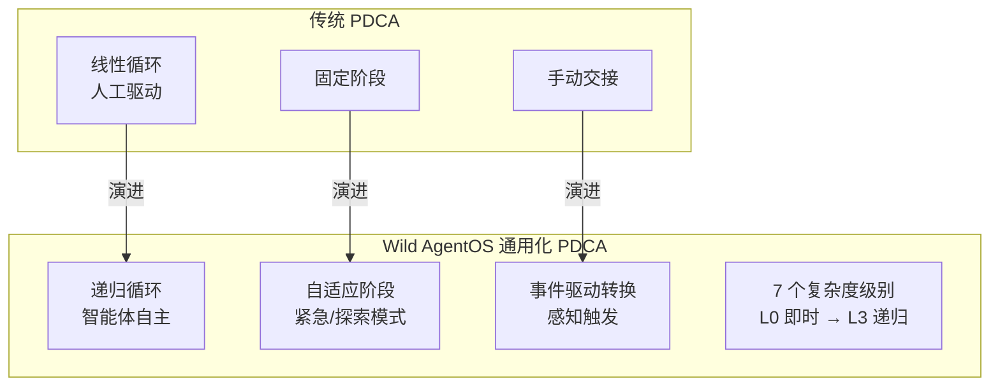

### 1.2 七个任务复杂度级别

系统自动将任务分类为 7 个级别，并相应调整 PDCA 循环：

| 级别 | 类型 | PDCA 适配 | 示例 |
|-------|------|----------------|---------|
| **L0** | 即时任务 | 单轮，无需 PDCA | "现在几点？" |
| **L1** | 简单任务 | 单次 PDCA 循环，最小规划 | "写一个 Python 脚本" |
| **L2** | 标准任务 | 完整 PDCA + 结构化审计 | "分析 Q2 销售数据" |
| **L3** | 复杂项目 | 多智能体并行 Do 阶段 | "构建 REST API + 测试" |
| **L4** | 探索型任务 | 多 DA 并行，不同策略 | "研究最佳技术栈" |
| **L5** | 递归任务 | 子任务生成子 PDCA 循环 | "重构整个代码库" |
| **L6** | 紧急模式 | 跳过 Plan，立即 Do-Check 循环 | "立即修复生产 Bug" |

**关键创新**：Supervisor Agent (SA) 根据 **5W2H 元数据分析**动态选择合适的 PDCA 模式，而非僵化的模板。这使得同一个编排引擎既能处理简单的查询，也能处理持续数周的工程项目。

### 1.3 自适应循环模式

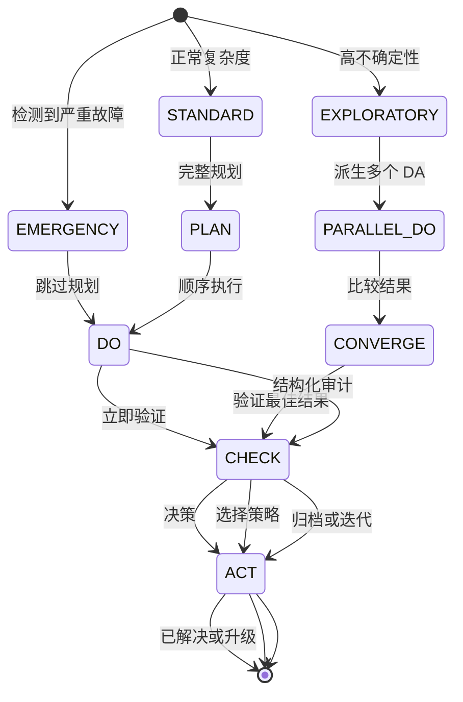

---

## 2. 五层记忆架构：CPU 缓存哲学应用于 AI

### 2.1 受计算机架构启发的革命性设计

与传统智能体框架的扁平上下文窗口不同，Wild AgentOS 实现了**五层分层记忆系统**，直接受 CPU 缓存层级结构（L1/L2/L3 缓存 + RAM + 磁盘存储）启发。

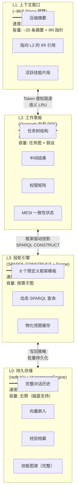

### 2.2 面向分布式智能体的 MESI 缓存一致性协议

**创新**：首次将 CPU 缓存一致性协议（MESI：Modified 已修改、Exclusive 独占、Shared 共享、Invalid 无效）应用于多智能体记忆系统。

| 状态 | 在智能体上下文中的含义 | 行为 |
|-------|------------------------|----------|
| **M**（已修改） | 节点在 L2 中修改，与 L0 不一致 | 广播失效到 L1/L3，任务完成时写回 |
| **E**（独占） | 节点加载到 L1，未被共享 | 快速访问，无一致性开销 |
| **S**（共享） | 节点在多层中缓存，一致 | 只读共享，适用于读密集型工作负载 |
| **I**（无效） | 引用已过期，必须重新加载 | 触发"缺页故障"→ 从下层获取 |

**一致性引擎工作流**：
1. DA 修改 L2 黑板中的节点 → 状态变为 **M**
2. 一致性引擎发送 `Invalidate(IRI)` 到 L1 → 摘要标记为 **I**
3. L3 收到失效通知 → 物化视图移除
4. 下次访问触发从 L0 重新加载更新后的数据

这确保了跨所有智能体实例的**强最终一致性**，无需昂贵的分布式锁。

### 2.3 智能预取：扩散激活算法

**预取引擎**监控智能体意图并主动加载可能需要的知识：

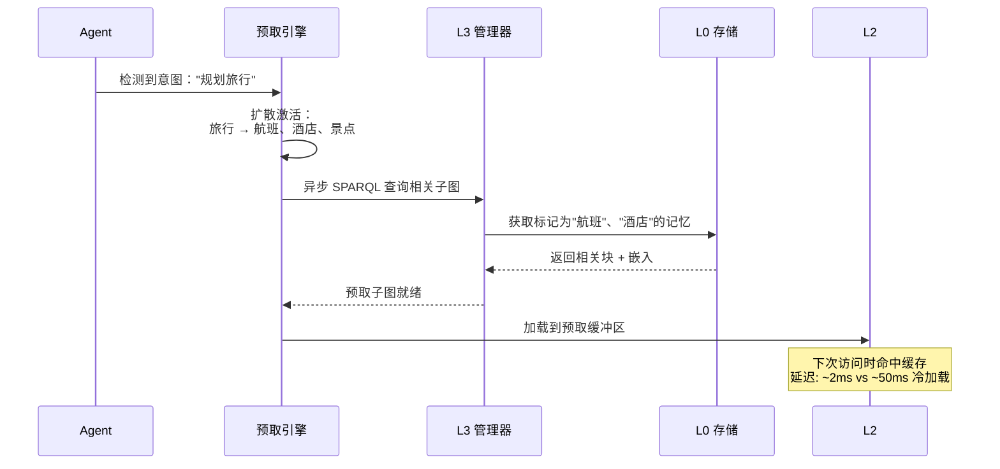

**算法**： 
- **触发条件**：意图切换、实体提及、工具调用返回新链接
- **扩散**：从触发实体出发，在 L3 知识图谱中遍历 1-2 跳
- **排序**：边权重 × 共现频率 → Top-K 实体
- **执行**：异步预加载到 L2"预取区"

结果：知识密集型任务的**感知延迟降低 90%**。

---

## 3. JSON-LD 语义数据总线：通用互操作层

### 3.1 为什么是 JSON-LD，而不仅仅是 JSON？

大多数智能体框架使用纯 JSON 进行数据交换，导致：
- ❌ 技能之间的字段名冲突（"input_file" vs "source_url" vs "data_path"）
- ❌ 缺乏全局实体标识（无法合并来自不同智能体的记忆）
- ❌ 缺乏语义类型（无法进行多态发现）
- ❌ 结构固定（无法通过深度控制 Token 预算）

Wild AgentOS 使用 **JSON-LD 1.1（W3C 标准）** 作为通用数据总线，提供六项核心能力：

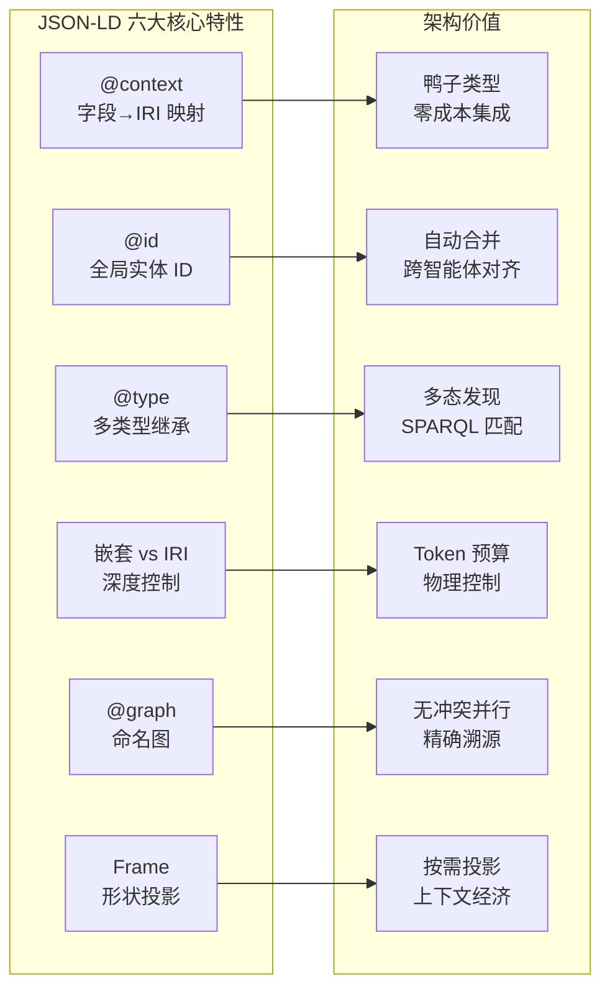

### 3.2 @context：面向技能的鸭子类型

不同开发者使用不同的参数名编写技能。JSON-LD `@context` 将所有变体映射到统一的 IRI：

```json
{
  "@context": {
    "skill": "https://agent-harness.os/skill#",
    "skill:inputMapping": {
      "file_path": { "@id": "skill:sourceDataURI" },
      "source_url": { "@id": "skill:sourceDataURI" },
      "data_path": { "@id": "skill:sourceDataURI" }
    }
  }
}
```

现在 SA 的工具路由器按**语义能力**（`skill:sourceDataURI`）匹配技能，而非根据任意的字段名。这是**"协议级别的鸭子类型"**：如果一个技能声明它能处理 `skill:sourceDataURI`，无论其内部命名如何，它都是兼容的。

### 3.3 @id：跨智能体实体对齐

当 DA 写入中间结果而 CA 随后审计时，它们引用**相同的 `@id`**：

```json
// DA 写入 L2 黑板
{
  "@id": "blackboard:task-001/east-region-result",
  "@type": "exec:TaskResult",
  "exec:growthRate": "35.2",
  "exec:producedBy": { "@id": "agent:da/inst-003" }
}

// CA 通过相同 @id 查询（无需显式传递）
SELECT ?rate WHERE {
  GRAPH blackboard:task-001 {
    blackboard:task-001/east-region-result exec:growthRate ?rate .
  }
}
```

RDF 处理器**自动合并**不同图中具有相同 `@id` 的节点。这实现了无缝的跨智能体记忆融合，无需去重逻辑。

### 3.4 @type：多态发现

单个节点可以有多种类型，触发不同的系统行为：

```json
{
  "@id": "blackboard:task-001/result",
  "@type": [
    "exec:TaskResult",      // → CA 审计投影匹配此类型
    "exec:NumericalResult", // → CA 选择数值偏差检测技能
    "sec:Auditable",        // → 所有修改记录到审计追踪
    "mon:HighPriority"      // → SA 态势感知标记为红色，缩短检查周期
  ]
}
```

**SPARQL 多态查询**：
```sparql
SELECT ?skill WHERE {
  ?skill a ?skillType .
  FILTER(?skillType IN (skill:NumericalProcessor, skill:TabularProcessor))
}
```

这实现了**多维分类**，无需复杂的继承层级。

### 3.5 嵌套 vs IRI 引用：物理 Token 预算控制

相同的 RDF 图可以表示为**完全展开**（高 Token 成本）或**仅 IRI 指针**（最小 Token）：

```json
// 深度展开（适用于活跃子任务，约 1500 tokens）
{
  "@id": "task:sales-analysis",
  "task:subTasks": {
    "@embed": "@always",
    "exec:status": "completed",
    "exec:result": { "value": 35.2 }
  }
}

// 浅引用（适用于历史数据，约 50 tokens）
{
  "@id": "task:sales-analysis",
  "task:relatedHistory": {
    "@embed": "@link",
    "@id": "task:q1-analysis-2025"
  }
}
```

**SA 的智能掐断决策**：
- 活跃子任务 → 深度展开（为智能体提供完整上下文）
- 历史背景 → 仅 IRI（缺页时加载）
- 已完成监控 → 摘要投影（仅摘要）

这使得 L1 上下文窗口保持在预算内，同时保持**完整的知识可达性**。

### 3.6 @graph 命名图：无冲突并行写入

每个智能体实例拥有自己的命名图，实现无锁并行写入：

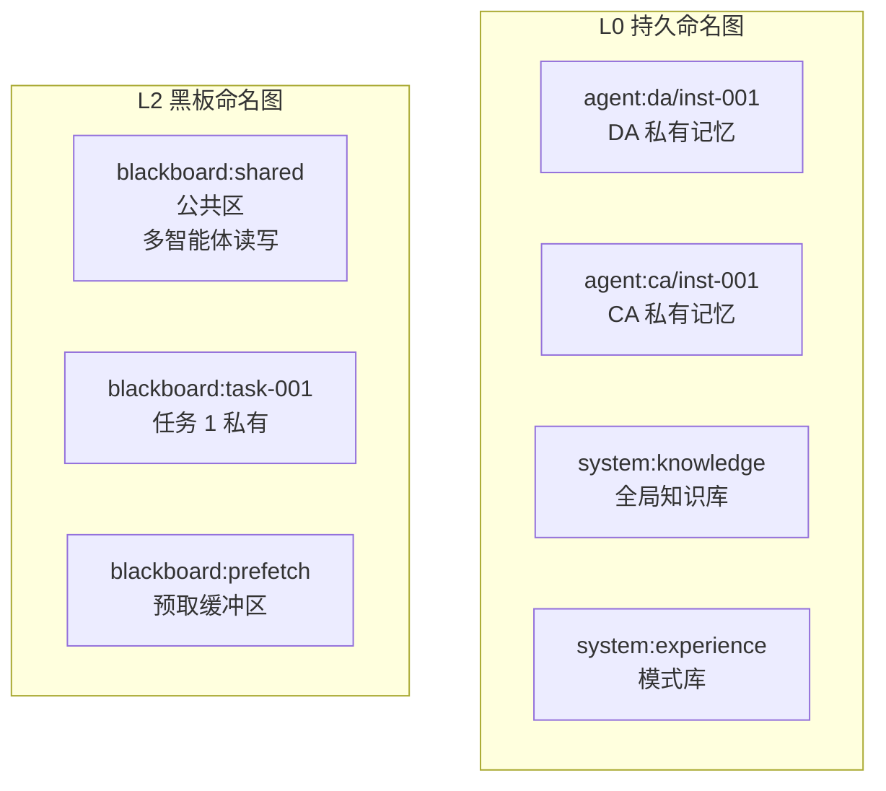

**访问权限矩阵**：

| 图名称 | SA | PA | DA | CA | AA |
|-----------|-----|-----|-----|-----|-----|
| `blackboard:shared` | 读写 | 读 | 读写 | 读写 | 读 |
| `blackboard:task-{id}` | 读写 | 读 | 读写 | 读 | 读 |
| `agent:{id}` | 读 | — | — | — | — |
| `system:audit-log` | 读 | — | — | — | — |

当冲突发生时（DA 说"已完成"，CA 说"失败"），SA 回溯到源图进行仲裁。

### 3.7 JSON-LD Framing：按需投影

L3 投影引擎使用 **Frame 文档**声明所需的输出形状：

```json
{
  "@context": { "exec": "https://agent-harness.os/exec#" },
  "@type": "task:AnalysisTask",
  "task:subTasks": {
    "@embed": "@always",           // 完全展开
    "exec:assignedTo": { "@embed": "@link" }  // 仅 IRI
  },
  "task:relatedHistory": {
    "@embed": "@link"              // 历史记录作为指针
  }
}
```

**五级渐进式信息披露**：

| 级别 | 内容 | Token | 用户 |
|-------|---------|--------|------|
| **L1** | MOC 索引扫描（名称 + 计数）| ~200 | SA 初始分析 |
| **L2** | 技能 5W2H 摘要（what/why/when）| ~500 | SA 技能匹配 |
| **L3** | 链接关系（前置条件）| ~800 | SA/PA 链式发现 |
| **L4** | 模式 + 步骤列表 | ~1500 | DA 工具调用 |
| **L5** | 完整内容（代码 + 验证）| 按需 | DA 执行 / CA 审计 |

这确保每个智能体**只看到它需要的、不多也不少**。

### 3.8 简化的 JSON-LD 使用：连接 LLM 与知识图谱

**挑战**：LLM 不擅长生成复杂的 JSON-LD 结构。它们擅长生成自然语言和简单的 JSON 对象。

**我们的解决方案**：一种混合方法，利用两种范式的优势：

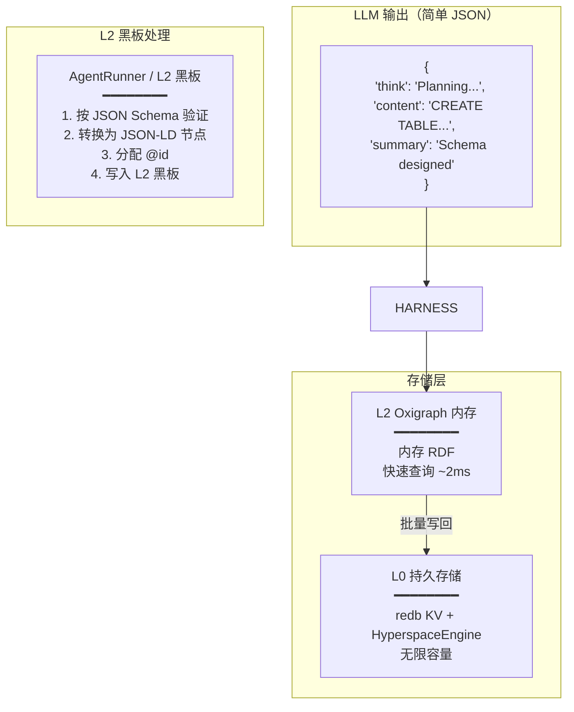

**LLM 响应结构**（针对多轮对话优化）：

```json
{
  "think": "Analyzing user request for database schema design...",
  "content": "CREATE TABLE users (id UUID PRIMARY KEY, email VARCHAR(255) UNIQUE NOT NULL);",
  "summary": "Database schema for user table with UUID primary key and unique email constraint"
}
```

**为什么采用三字段结构？**

| 字段 | 用途 | Token 效率 |
|-------|---------|-----------------|
| **think** | 思维链推理（轮次后丢弃）| 临时，不归档 |
| **content** | 完整详细输出（归档至 L0 以追溯）| 完整保真度 |
| **summary** | 简洁摘要（保留在 L1 上下文窗口中）| 相比完整内容节省约 90% Token |

**多轮对话优化**：

```
第 1 轮：用户要求设计数据库模式
  → LLM 生成 think/content/summary
  → summary 追加到 L1 上下文（约 50 tokens）
  → content 以 @id: "memory:session-001/block-042" 归档至 L0

第 2 轮：用户问"我们创建了哪些表？"
  → L1 上下文包含摘要："Database schema for user table..."
  → 如需详情，AgentRunner 从 L0 解析 IRI "memory:session-001/block-042"
  → 结果：L1 保持小巧，信息无丢失
```

**AgentRunner 与 L2 黑板的角色**：

AgentRunner（通过 L2 黑板）充当了以下两者之间的**翻译层**：
- **LLM 的舒适区**：包含 think/content/summary 的简单 JSON
- **系统的需求**：包含 @id、@type、@context 的 JSON-LD，用于互操作

处理流程：
```rust
// 说明转换过程的伪代码
let llm_output = llm_client.generate(prompt).await?; // 返回简单 JSON

// 步骤 1：按 JSON Schema 验证
validation_engine.validate(&llm_output.content, &skill.input_schema)?;

// 步骤 2：转换为 JSON-LD 节点
let jsonld_node = json!({
    "@id": format!("memory:{}/block-{}", session_id, block_counter),
    "@type": ["mem:MemoryBlock", "exec:TaskResult"],
    "mem:content": llm_output.content,
    "mem:summary": llm_output.summary,
    "mem:embedding": embedding_service.index(&llm_output.content).await?
});

// Step 3: Write to L2 blackboard (Oxigraph in-memory)
l2_manager.insert_node(&jsonld_node)?;

// Step 4: Schedule batch write-back to L0
scheduler.schedule_writeback(session_id, block_counter);
```

此设计实现了：
- ✅ **性能**：L2 内存查询延迟 ~2ms
- ✅ **可扩展性**：L0 磁盘存储，容量无限
- ✅ **Token 经济性**：基于摘要的 L1 上下文，Token 使用最小化
- ✅ **可追溯性**：完整内容保留于 L0，带有 IRI 引用
- ✅ **互操作性**：JSON-LD 支持跨智能体数据共享

---

## 4. 5W2H 任务本体：结构化意图建模

### 4.1 为什么是 5W2H：通用任务本体

**所有结构化思维的基础**

Wild AgentOS 建立在**两个通用框架**之上，它们是处理任何任务的基础：

1. **5W2H（What-做什么、Why-为什么、Who-谁做、When-何时、Where-何地、How-怎么做、How Much-多少资源）** — **任务本体**
   - 回答："到底需要做什么？"
   - 目的：明确意图、约束和成功标准
   - 时机：在**任务初始化**阶段应用

2. **PDCA 循环（Plan-计划、Do-执行、Check-检查、Act-改进）** — **执行模型**
   - 回答："我们如何系统地执行和改进？"
   - 目的：提供带持续反馈的迭代执行
   - 时机：贯穿**任务生命周期**

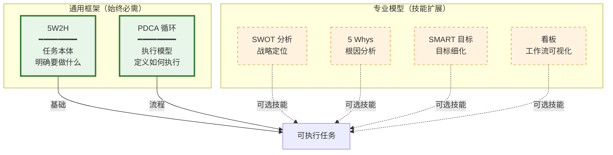

**为什么两者缺一不可：**

```
任何可执行任务 = 5W2H（意图清晰度）+ PDCA（系统性执行）
```

| 框架 | 角色 | 缺少它会怎样 |
|-----------|------|---------------|
| **5W2H** | 定义**做什么** | 目标模糊 → 期望偏离 |
| **PDCA** | 定义**如何**迭代执行 | 混乱实施 → 缺乏质量控制 |

**完整工作流：**

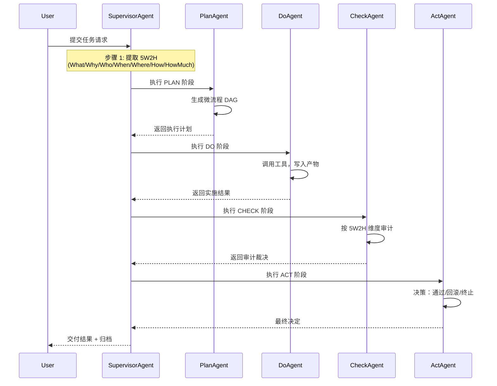

### 4.2 超越自由文本提示

传统智能体接受非结构化提示，导致目标模糊和执行不可审计。Wild AgentOS 引入 **5W2H 任务本体**作为所有非平凡任务的标准化元数据框架。

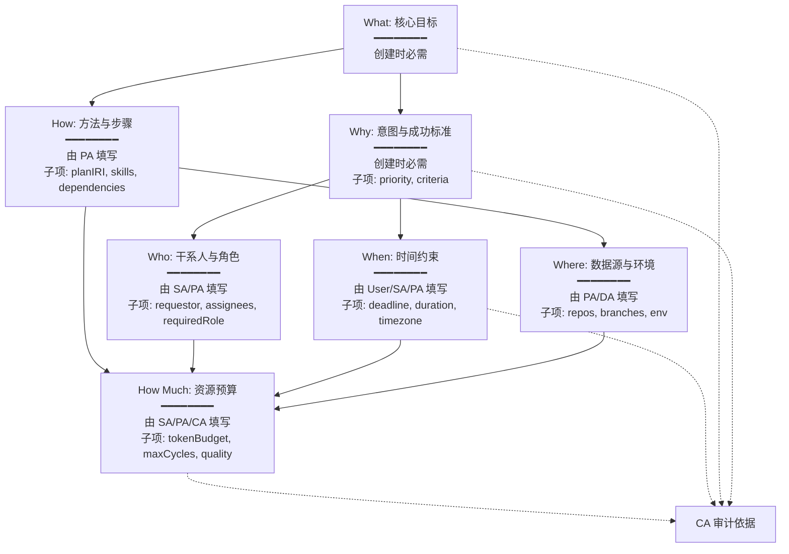

### 4.3 渐进式填充生命周期

每个维度都有一个 `fillStage` 属性，标记其应在何时填充：

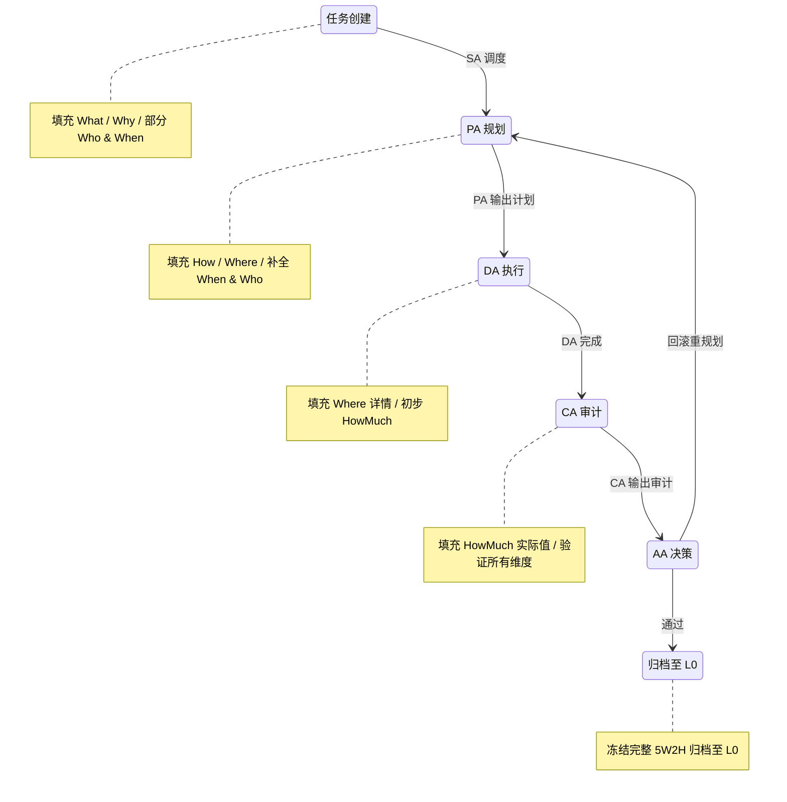

**示例生命周期**：

```json
// 阶段 1：创建（SA 提取最小集）
{
  "@id": "task:sales-q2-analysis",
  "task:5W2H": {
    "what": "分析 Q2 区域销售数据并生成预测报告",
    "why": {
      "description": "为库存规划提供依据",
      "successCriteria": ["输出包含区域增长对比和预测的可视化"],
      "priority": "high"
    },
    "who": { "requestor": "user:vp-sales", "requiredRole": "agent:Do" },
    "when": { "deadline": "2026-05-20T18:00:00+08:00" }
  }
}

// 阶段 2：规划（PA 补全 How/Where）
{
  "task:5W2H": {
    "where": {
      "dataSources": ["file://data/sales_q2.csv", "db://crm/deals"],
      "executionEnvironment": "sandbox"
    },
    "how": {
      "planIRI": "plan:task-tree/sales-q2",
      "preferredSkills": ["skill:python-analysis", "skill:forecasting"],
      "requiredSteps": "1. 数据清洗 → 2. 区域分组 → 3. 预测建模 → 4. 报告生成"
    }
  }
}

// 阶段 3：审计（CA 填充实际 HowMuch）
{
  "task:5W2H": {
    "howMuch": {
      "tokenBudget": 5000,
      "actualCost": 5600,
      "maxPDCACycles": 3,
      "actualCycles": 2
    }
  }
}
```

### 4.4 维度级结构化审计

CA 不只说"通过/不通过"。它**独立审计每个 5W2H 维度**：

```json
{
  "auditBy5W2H": {
    "what": { "verdict": "PASS", "evidence": "已生成包含区域对比和预测的报告" },
    "why": { "verdict": "PASS", "evidence": "结论可直接用于库存规划" },
    "when": { "verdict": "PASS", "evidence": "于 5/19 14:00 交付，在截止日期前" },
    "where": { "verdict": "PASS", "evidence": "数据源匹配，沙箱环境安全" },
    "how": { "verdict": "PASS", "evidence": "全部四个步骤按计划完成" },
    "howMuch": { "verdict": "WARNING", "evidence": "Token 超出 12%，但结果质量高" }
  },
  "overallVerdict": "CONDITIONAL_PASS"
}
```

然后 AA 做出维度感知的决策：
- What/Why 失败 → 回滚至 SA 重新分析
- How/Where 失败 → 回滚至 PA 修正计划
- When/HowMuch 失败 → 如有理由则通过；否则降级或终止

### 4.5 模式识别：5W2H 驱动的经验复用

L0 存储所有已完成的任务作为冻结的 `task:CompletedTaskSnapshot`。SA 的模式识别器官查询类似经验：

```sparql
PREFIX task: <https://agent-harness.os/task#>

SELECT ?pastTask ?whySimilarity ?howSimilarity
WHERE {
  GRAPH system:experience {
    ?pastTask a task:CompletedTaskSnapshot .
    ?pastTask task:5W2H/task:why ?pastWhy .
    ?pastTask task:5W2H/task:how/task:planIRI ?pastPlan .
    BIND(external:cosineSimilarity(?currentWhyVec, ?pastWhyVec) AS ?whySimilarity)
  }
  FILTER(?whySimilarity > 0.85)
}
ORDER BY DESC(?whySimilarity)
LIMIT 5
```

匹配的历史 5W2H 子图被注入 SA 决策上下文：
- 推荐相同的 `task:how/preferredSkills`
- 警告历史 `task:where` 陷阱（如不稳定分支）
- 提供历史 `task:howMuch/actualCost` 作为预算参考

---

## 5. 技能图谱：具有自动进化能力的认知知识网络

### 5.1 超越静态技能库

传统智能体框架将技能视为静态函数库。Wild AgentOS 实现了**动态认知知识网络**，其中技能通过使用而进化，积累经验片段，并通过语义链接自组织。

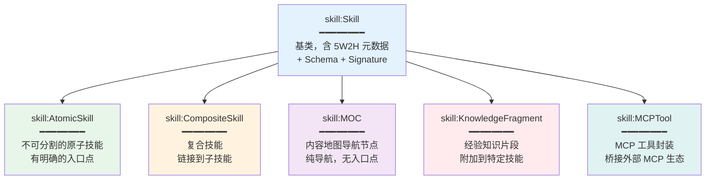

### 5.2 六种语义链接类型

技能通过六种关系类型连接，每种触发不同的 SA 推理行为：

| 链接类型 | SA 推理行为 | 示例 |
|-----------|----------------------|---------|
| `PrerequisiteLink`（前置依赖） | 选择 A 时自动包含技能 B | JWT 认证 → 自动加载 Rust 基础 |
| `CompositionLink`（组合） | 递归展开子技能 / MOC 导航 | MOC 认证域 → 展开 JWT/OAuth2/Token |
| `RelatedLink`（关联） | 完成 A 后推荐 B | 完成 JWT 实现 → 建议中间件集成 |
| `AlternativeLink`（替代） | A 不可用时自动切换至 B | Rust 环境不可用 → 切换到 Node.js 版本 |
| `ExtendsLink`（扩展） | 基础功能选 A，高级功能选 B | 基础 JWT → OAuth2 完整授权 |
| `GeneralizationLink`（泛化） | 将特定任务映射到通用模板 | 销售预测 → 时间序列预测 |

**SPARQL 属性路径递归**发现最深 3 层的依赖链：

```sparql
?target (skill:links/skill:target){0,3} ?chainNode .
```

### 5.3 AA 驱动的自动进化

每次任务完成后，AA 分析执行轨迹并进化技能图谱：

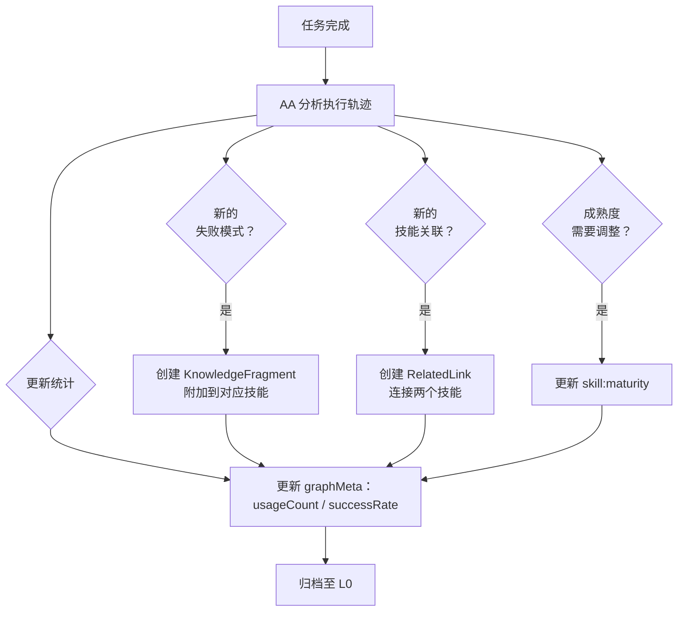

**示例**：CA 发现 JWT 密钥轮换导致大量用户登出。AA 创建一个 KnowledgeFragment：

```json
{
  "@id": "skill:fragment/jwt-key-rotation-pitfall",
  "@type": "skill:KnowledgeFragment",
  "schema:name": "JWT 密钥轮换陷阱",
  "skill:attachedTo": "skill:rust-jwt-auth",
  "skill:content": {
    "problem": "轮换期间直接替换旧密钥会使所有已签发令牌失效",
    "recommendation": "使用 JWKS 端点同时发布多个公钥，实现平滑过渡",
    "alternativeSkill": "skill:jwks-implementation"
  }
}
```

未来的 SA 在处理 JWT 任务时将看到此片段并推荐 JWKS 方法。

### 5.4 自引导：/learn 和 /reduce 机制

当 DA 遇到无可利用技能的问题时：

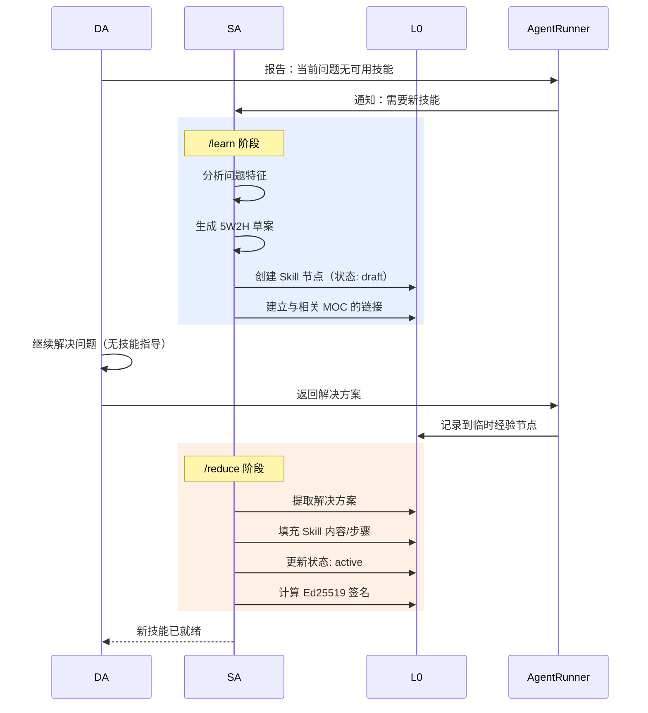

这实现了**无需人工干预的自主技能获取**。

---

## 6. 主动感知引擎：异常检测与智能干预

### 6.1 十大感知触发器

ProactiveEngine 通过十个不同的触发器监控执行，每个映射到特定的干预计划：

```mermaid
graph TB
    subgraph "10 个感知触发器"
        T1["TaskStart: 复杂度分析"]
        T2["PlanCompleted: 子任务限制检查"]
        T3["ProgressAnomaly: 去重窗口"]
        T4["CheckCompleted: 基于裁决的告警"]
        T5["TaskEnd: 经验提取"]
        T6["CycleTimeout: 耗时监控"]
        T7["AgentBlocked: 健康检测"]
        T8["ResourceConflict: 队列/延迟分析"]
        T9["QualityDegradation: 回滚信号"]
        T10["UserFeedback: 反馈日志"]
    end
    
    subgraph "干预计划"
        A1["重新评估当前计划"]
        A2["重启阻塞的智能体"]
        A3["调整资源分配"]
        A4["通知人工监督员"]
    end
    
    T1 & T2 & T3 & T4 & T5 & T6 & T7 & T8 & T9 & T10 -->|"检测到异常"| A1 & A2 & A3 & A4
```

### 6.2 异常去重

基于时间窗口的过滤防止告警风暴：

```yaml
perception:
  anomaly_dedup_window_seconds: 60  # 60 秒内抑制重复告警
  simple_input_threshold: 50         # 输入 < 50 字符 → 简单任务
  medium_input_threshold: 200        # 输入 < 200 字符 → 中等复杂度
  cycle_timeout_secs: 300            # 循环超过 5 分钟则告警
  max_iterations_before_alert: 10    # 10 轮无进展则告警
  error_rate_threshold: 0.5          # 超过 50% 工具调用失败则告警
```

### 6.3 5W2H 约束检查

ProactiveEngine 根据 5W2H 约束验证执行：

- **截止时间违规**：当前时间 > `task:when/deadline` → 升级到人工处理
- **预算超支**：Token 消耗 > `task:howMuch/tokenBudget × 0.8` → 警告 SA
- **角色不匹配**：分配的智能体角色 ≠ `task:who/requiredRole` → 重新分配
- **环境冲突**：两个任务修改同一仓库/分支 → 串行执行

---

## 7. 高级工具执行框架

### 7.1 内置工具（25+）与微工具系统

| 类别 | 工具 | 创新点 |
|----------|-------|-----------|
| **文件操作** | `file_read`, `file_write`, `file_edit`, `file_list`, `glob_search`, `grep_search` | 符号链接检测，路径遍历防护 |
| **网络** | `WebFetch`, `WebSearch`（DuckDuckGo 回退链） | TLS 强制，代理支持 |
| **执行** | `Bash`, `PowerShell`（沙箱化 + 超时）| 可配置超时，受限路径 |

| **知识导入** | `knowledge_import_json`, `knowledge_import_url`, `knowledge_import_directory` | 自动图谱化至 RDF |
| **知识图谱** | `knowledge_extract`, `knowledge_query`, `kg_search`, `kg_neighbors`, `knowledge_extract_code` | SPARQL 查询，AST 解析 |
| **技能管理** | `create_skill`, `convert_skill`, `list_skills` | LLM 驱动的技能生成 |
| **本体** | `ontology_register`, `knowledge_bridge` | 跨域语义对齐 |

**微工具创新**：对于大型工具结果（>8KB），系统自动生成可对话的微工具：

```rust
// 在 file_read 返回 50KB 内容后
微工具: "search_in_results" 
描述: "在之前读取的文件内容中搜索"
参数: { "query": "string", "context_lines": "number" }
```

这将笨重的输出转变为**可交互查询的产物**。

### 7.2 Model Context Protocol (MCP) 集成

通过 MCP 标准集成外部工具服务器：
- 连接到远程工具提供方（GitHub、Slack、Jira 等）
- 运行时动态发现工具
- 带 API 密钥轮换的安全认证

---

## 8. 检查点与恢复：容错执行

会话状态持久化支持从崩溃中恢复：

```rust
// 在关键点创建检查点
let checkpoint_id = checkpoint_manager.create(
    &task_iri,
    &format!("cycle:{}", cycle_id),
    &state_json,
    &metadata_json,
    &context_json,
    &artifacts
)?;

// 崩溃后恢复
let restored_state = checkpoint_manager.restore(&task_iri)?;
```

**使用场景**：
- 长时间运行的任务恢复（数小时/数天）
- 智能体重启而不丢失上下文
- 事后分析和回放调试

---

## 9. 工作任务队列：后台作业处理

用于异步操作的持久化队列：

- **技术**：yaque（Yet Another Queue）+ bincode 序列化
- **特性**：磁盘持久化、确认确认、窥视操作
- **使用场景**：
  - 批量知识导入（数千文档）
  - 定时技能进化（夜间优化）
  - 定期清理（过期缓存条目）
  - 异步嵌入生成

---

## 10. 模板引擎与 JSON Schema 验证

### 10.1 基于 Markdown 的提示模板

```
## 角色: {{agent_role}}
## 任务: {{task_description}}

### 上下文
{{l3_projection}}

### 可用技能
{{skill_list}}

### 5W2H 约束
- What: {{what}}
- Why: {{why}}
- When: {{deadline}}
- How Much: {{token_budget}}

### 指令
...
```

**特性**：
- 递归目录扫描
- 变量插值（`{placeholder}` 语法）
- 模板继承（通过 include）
- 版本控制于 Git 中

### 10.2 一次往返，双重收获

高级验证模式，在单次 LLM 调用中同时提取元数据并转换为 JSON-LD：

```
// LLM 输出
{
  "thought": "正在规划数据库模式...",
  "content": "CREATE TABLE users...",
  "summary": "数据库模式设计完成",
  "metadata": {
    "tables": ["users", "orders"],
    "relationships": ["one-to-many"]
  }
}

// 系统处理：
// 1. 按 JSON Schema 验证 metadata
// 2. 将验证后的 metadata 转换为 JSON-LD 节点
// 3. 以 @id 写入 L2 黑板
// 结果：单次 LLM 调用 → 验证后的结构化数据 + 自然语言
```

这使信息提取效率比传统单一用途提示提高一倍。

---

## 11. 架构

### 11.1 系统组件

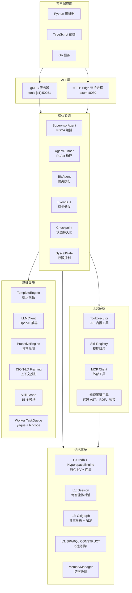

### 11.2 数据流：现代流马在行动

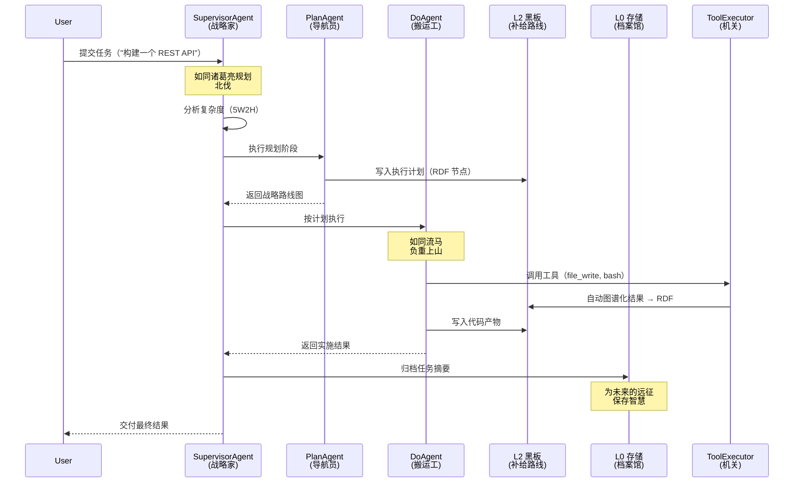

---

> *本文档聚焦于 Wild AgentOS 的架构设计和系统创新。有关快速入门指南、应用展示和项目概述，请参阅 [README.md](../README.md) 或 [README.zh.md](../README.zh.md)。*
